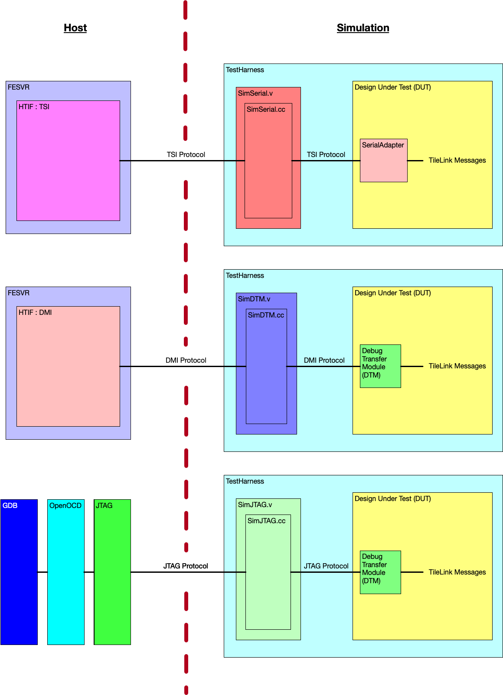
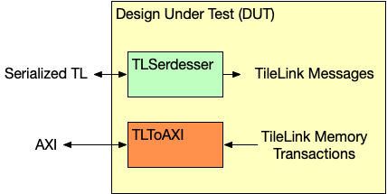
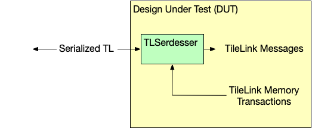
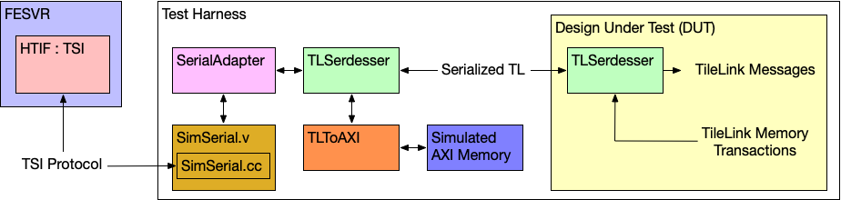
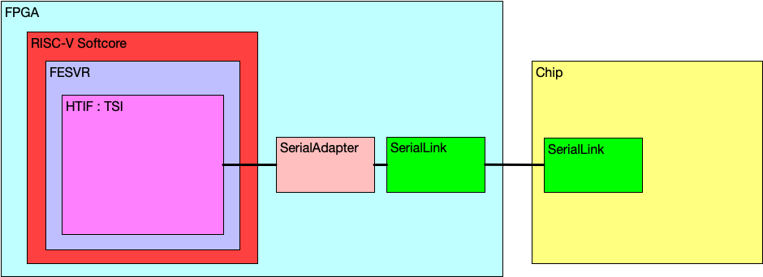

.. _chip-communication:

Communicating with the DUT
===============================

There are two types of DUTs that can be made: `tethered` or `standalone` DUTs.
A `tethered` DUT is where a host computer (or just host) must send transactions to the DUT to bringup a program.
This differs from a `standalone` DUT that can bringup itself (has its own bootrom, loads programs itself, etc).
An example of a tethered DUT is a Chipyard simulation where the host loads the test program into the DUTs memory and signals to the DUT that the program is ready to run.
An example of a standalone DUT is a Chipyard simulation where a program can be loaded from an SDCard out of reset.
In this section, we mainly describe how to communicate to tethered DUTs.

There are two ways the host (otherwise known as the outside world) can communicate with a tethered Chipyard DUT:

* Using the Tethered Serial Interface (TSI) or the Debug Module Interface (DMI) with the Front-End Server (FESVR) to communicate with the DUT
* Using the JTAG interface with OpenOCD and GDB to communicate with the DUT

The following picture shows a block diagram view of all the supported communication mechanisms
split between the host and the simulation.

Using the Tethered Serial Interface (TSI) or the Debug Module Interface (DMI)
-----------------------------------------------------------------------------

If you are using TSI or DMI to communicate with the DUT, you are using
the Front-End Server (FESVR) to facilitate communication between the host and the DUT.

Primer on the Front-End Server (FESVR)
~~~~~~~~~~~~~~~~~~~~~~~~~~~~~~~~~~~~~~

FESVR is a C++ library that manages communication
between a host machine and a RISC-V DUT. For debugging, it provides a simple API to reset,
send messages, and load/run programs on a DUT. It also emulates peripheral devices.
It can be incorporated with simulators (VCS, Verilator, FireSim), or used in a bringup sequence
for a taped out chip.

Specifically, FESVR uses the Host Target Interface (HTIF), a communication protocol,
to speak with the DUT. HTIF is a non-standard Berkeley protocol that uses a FIFO non-blocking
interface to communicate with the DUT. It defines a protocol where you can read/write memory,
load/start/stop the program, and more. Both TSI and DMI implement this HTIF protocol differently
in order to communicate with the DUT.

Using the Tethered Serial Interface (TSI)
~~~~~~~~~~~~~~~~~~~~~~~~~~~~~~~~~~~~~~~~~

By default, Chipyard uses the Tethered Serial Interface (TSI) to communicate with the DUT.
TSI protocol is an implementation of HTIF that is used to send commands to the RISC-V DUT.
These TSI commands are simple R/W commands that are able to access the DUT's memory space.
During simulation, the host sends TSI commands to a simulation stub in the test harness called ``SimTSI``
(C++ class) that resides in a ``SimTSI`` Verilog module (both are located in the ``generators/testchipip``
project).
This ``SimTSI`` Verilog module then sends the TSI command recieved by the simulation stub
to an adapter that converts the TSI command into a TileLink request.
This conversion is done by the ``TSIToTileLink`` module (located in the ``generators/testchipip`` project).
After the transaction is converted to TileLink, the ``TLSerdesser`` (located in ``generators/testchipip``) serializes the
transaction and sends it to the chip (this ``TLSerdesser`` is sometimes also referred to as a digital serial-link or SerDes).
Once the serialized transaction is received on the chip, it is deserialized and masters a TileLink bus on the chip
which handles the request.
In simulation, FESVR resets the DUT, writes into memory the test program, and indicates to the DUT to start the program
through an interrupt (see :ref:`customization/Boot-Process:Chipyard Boot Process`).
Using TSI is currently the fastest mechanism to communicate with the DUT in simulation (compared to DMI/JTAG) and is also used by FireSim.

Using the Debug Module Interface (DMI)
~~~~~~~~~~~~~~~~~~~~~~~~~~~~~~~~~~~~~~

Another option to interface with the DUT is to use the Debug Module Interface (DMI).
Similar to TSI, the DMI protocol is an implementation of HTIF.
In order to communicate with the DUT with the DMI protocol, the DUT needs to contain a Debug Transfer Module (DTM).
The DTM is given in the `RISC-V Debug Specification <https://riscv.org/specifications/debug-specification/>`__
and is responsible for managing communication between the DUT and whatever lives on the other side of the DMI (in this case FESVR).
This is implemented in the Rocket Chip ``Subsystem`` by having the ``HasPeripheryDebug`` and ``HasPeripheryDebugModuleImp`` traits.
During simulation, the host sends DMI commands to a
simulation stub called ``SimDTM`` (C++ class) that resides in a ``SimDTM`` Verilog module
(both are located in the ``generators/rocket-chip`` project). This ``SimDTM`` Verilog module then
sends the DMI command recieved by the simulation stub into the DUT which then converts the DMI
command into a TileLink request. This conversion is done by the DTM named ``DebugModule`` in the ``generators/rocket-chip`` project.
When the DTM receives the program to load, it starts to write the binary byte-wise into memory.
This is considerably slower than the TSI protocol communication pipeline (i.e. ``SimTSI``/``TSIToTileLink``/TileLink)
which directly writes the program binary to memory.

Starting the TSI or DMI Simulation
~~~~~~~~~~~~~~~~~~~~~~~~~~~~~~~~~~

All default Chipyard configurations use TSI to communicate between the simulation and the simulated SoC/DUT.
Hence, when running a software RTL simulation, as is indicated in the
:ref:`simulation/Software-RTL-Simulation:Software RTL Simulation` section, you are in-fact using TSI to communicate with the DUT.
As a reminder, to run a software RTL simulation, run:

.. code-block:: bash

   cd sims/verilator
   # or
   cd sims/vcs

   make CONFIG=RocketConfig run-asm-tests

If you would like to build and simulate a Chipyard configuration with a DTM configured for DMI communication,
then you must tie-off the serial-link interface, and instantiate the `SimDTM`.

.. literalinclude:: ../../generators/chipyard/src/main/scala/config/PeripheralDeviceConfigs.scala
    :language: scala
    :start-after: DOC include start: DmiRocket
    :end-before: DOC include end: DmiRocket

Then you can run simulations with the new DMI-enabled top-level and test-harness.

.. code-block:: bash

    cd sims/verilator
    # or
    cd sims/vcs

    make CONFIG=dmiRocketConfig run-asm-tests

Using the JTAG Interface
------------------------

Another way to interface with the DUT is to use JTAG.
Similar to the :ref:`Advanced-Concepts/Chip-Communication:Using the Debug Module interface (DMI)` section, in order to use the JTAG protocol,
the DUT needs to contain a Debug Transfer Module (DTM) configured to use JTAG instead of DMI.
Once the JTAG port is exposed, the host can communicate over JTAG to the DUT through a simulation stub
called ``SimJTAG`` (C++ class) that resides in a ``SimJTAG`` Verilog module (both reside in the ``generators/rocket-chip`` project).
This simulation stub creates a socket that OpenOCD and GDB can connect to when the simulation is running.
The default Chipyard designs instantiate the DTM configured to use JTAG (i.e. ``RocketConfig``).

.. note::
    As mentioned, default Chipyard designs are enabled with JTAG.
    However, they also use TSI/Serialized-TL with FESVR in case the JTAG interface isn't used.
    This allows users to choose how to communicate with the DUT (use TSI or JTAG).

Debugging with JTAG
~~~~~~~~~~~~~~~~~~~

Roughly the steps to debug with JTAG in simulation are as follows:

1. Build a Chipyard JTAG-enabled RTL design. Remember default Chipyard designs are JTAG ready.

.. code-block:: bash

    cd sims/verilator
    # or
    cd sims/vcs

    make CONFIG=RocketConfig

2. Run the simulation with remote bit-bang enabled. Since we hope to load/run the binary using JTAG,
   we can pass ``none`` as a binary (prevents FESVR from loading the program). (Adapted from: https://github.com/chipsalliance/rocket-chip#3-launch-the-emulator)

.. code-block:: bash

    # note: this uses Chipyard make invocation to run the simulation to properly wrap the simulation args
    make CONFIG=RocketConfig BINARY=none SIM_FLAGS="+jtag_rbb_enable=1 --rbb-port=9823" run-binary

3. `Follow the instructions here to connect to the simulation using OpenOCD + GDB. <https://github.com/chipsalliance/rocket-chip#4-launch-openocd>`__

.. note::
    This section was adapted from the instruction in Rocket Chip and riscv-isa-sim. For more information refer
    to that documentation: `Rocket Chip GDB Docs <https://github.com/chipsalliance/rocket-chip#-debugging-with-gdb>`__,
    `riscv-isa-sim GDB Docs <https://github.com/riscv/riscv-isa-sim#debugging-with-gdb>`__

Example Test Chip Bringup Communication
---------------------------------------

Intro to Typical Chipyard Test Chip
~~~~~~~~~~~~~~~~~~~~~~~~~~~~~~~~~~~

Most, if not all, Chipyard configurations are tethered using TSI (over a serial-link) and have access
to external memory through an AXI port (backing AXI memory).
The following image shows the DUT with these set of default signals:

In this setup, the serial-link is connected to the TSI/FESVR peripherals while the AXI port is connected
to a simulated AXI memory.
However, AXI ports tend to have many signals, and thus wires, associated with them so instead of creating an AXI port off the DUT,
one can send the memory transactions over the bi-directional serial-link (``TLSerdesser``) so that the main
interface to the DUT is the serial-link (which has comparatively less signals than an AXI port).
This new setup (shown below) is a typical Chipyard test chip setup:

Simulation Setup of the Example Test Chip
~~~~~~~~~~~~~~~~~~~~~~~~~~~~~~~~~~~~~~~~~

The standard test-chip bringup procedure tethers the chip to a FPGA config with serialized tilelink.

The entire bringup procedure can be simulated using the Multi-ChipTop simulation feature, where
one ``ChipTop`` is the design-to-be-taped-out, while the other is the FPGA bringup design.

This system can be generated and simulated with the following example configuration, which marries
a ``ChipLikeRocketConfig`` (the design to be taped-out) with the ``ChipBringupHostConfig`` (the FPGA
bringup design).

.. literalinclude:: ../../generators/chipyard/src/main/scala/config/ChipConfigs.scala
    :language: scala
    :start-after: DOC include start: TetheredChipLikeRocketConfig
    :end-before: DOC include end: TetheredChipLikeRocketConfig

Softcore-driven Bringup Setup of the Example Test Chip after Tapeout
~~~~~~~~~~~~~~~~~~~~~~~~~~~~~~~~~~~~~~~~~~~~~~~~~~~~~~~~~~~~~~~~~~~~

.. warning::
   Bringing up test chips with a FPGA softcore  as described here is discouraged.
   An alternative approach using the FPGA to "bridge" between a host computer and the test chip is the preferred approach.

Assuming this example test chip is taped out and now ready to be tested, we can communicate with the chip using this serial-link.
For example, a common test setup used at Berkeley to evaluate Chipyard-based test-chips includes an FPGA running a RISC-V soft-core that is able to speak to the DUT (over an FMC).
This RISC-V soft-core would serve as the host of the test that will run on the DUT.
This is done by the RISC-V soft-core running FESVR, sending TSI commands to a ``TSIToTileLink`` / ``TLSerdesser`` programmed on the FPGA.
Once the commands are converted to serialized TileLink, then they can be sent over some medium to the DUT
(like an FMC cable or a set of wires connecting FPGA outputs to the DUT board).
Similar to simulation, if the chip requests offchip memory, it can then send the transaction back over the serial-link.
Then the request can be serviced by the FPGA DRAM.
The following image shows this flow:

In fact, this exact type of bringup setup is what the following section discusses:
:ref:_legacy-vcu118-bringup.
