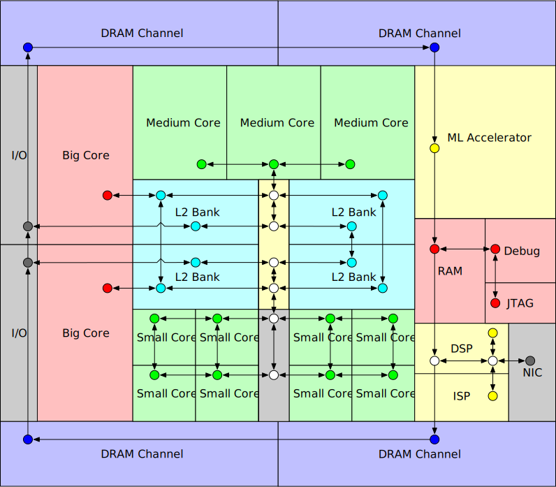

Constellation
========================

`Constellation <https://github.com/ucb-bar/constellation>`__ is a Chisel NoC RTL generator framework designed from the ground up to support integration in a heterogeneous SoC and evaluation of highly irregular NoC architectures.

 - Constellation generates **packet-switched wormhole-routed networks with virtual networks and credit-based flow control**
 - Constellation supports **arbitrary directed graph network topologies**, including **irregular** and **hierarchical** network topologies
 - Constellation includes a **routing algorithm verifier and routing-table compiler**, which can verify and generate deadlock-free routing tables for arbitrary topologies
 - Constellation is a **protocol-independent transport layer**, yet is capable of compliant deadlock-free transport of protocols like **AXI-4** and **TileLink**
 - Constellation supports drop-in **integration in Chipyard/Rocketchip SoCs**
 - Constellation is **rigorously tested**, with almost 100 different tests across as many network configurations

Constellation is fully integrated into Chipyard, and can be used to generate almost any interconnect in a Chipyard/Rocketchip-based SoC.

For documentation on Constellation, see its `documentation pages <http://constellation.readthedocs.io>`__.
