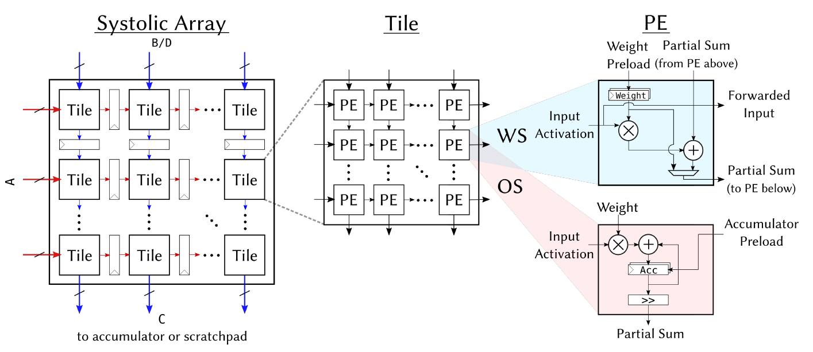

Gemmini
====================================

The Gemmini project is developing a systolic-array based matrix multiplication unit generator for the investigation of software/hardware implications of such integrated SoC accelerators. It is inspired by recent trends in machine learning accelerators for edge and mobile SoCs.

Gemmini is implemented as a RoCC accelerator with non-standard RISC-V custom instructions. The Gemmini unit uses the RoCC port of a Rocket or BOOM `tile`, and by default connects to the memory system through the System Bus (i.e., directly to the L2 cache). 

To add a Gemmini unit to an SoC, you should add the ``gemmini.DefaultGemminiConfig`` config mixin to the SoC configurations. To change the configuration of the Gemmini accelerator unit, you can write a custom configuration to replace the ``DefaultGemminiConfig``, which you can view under `generators/gemmini/src/main/scala/configs.scala <https://github.com/ucb-bar/gemmini/blob/master/src/main/scala/gemmini/configs.scala>`__ to see the possible configuration parameters.

The example Chipyard config includes the following example SoC configuration which includes Gemmini:

.. literalinclude:: ../../generators/example/src/main/scala/RocketConfigs.scala
    :language: scala
    :start-after: DOC include start: GemminiRocketConfig
    :end-before: DOC include end: GemminiRocketConfig

To build a simulation of this example Chipyard config, run the following commands:

.. code-block:: shell

    cd sims/verilator # or "cd sims/vcs"
    make CONFIG=GemminiRocketConfig

.. image:: ../_static/images/gemmini-system.png

Generator Parameters
--------------------------

Major parameters of interest include:

* Systolic array dimensions (``tileRows``, ``tileColumns``, ``meshRows``, ``meshColumns``): The systolic array is composed of a 2-level hierarchy, in which each tile is fully combinational, while a mesh of tiles has pipeline registers between each tile.

* Dataflow parameters (``dataflow``): Determine whether the systolic array in Gemmini is output-stationary or weight-stationary, or whether it supports both dataflows so that programmers may choose between them at runtime.

* Scratchpad and accumulator memory parameters (``sp_banks``, ``sp_capacity``, ``acc_capacity``): Determine the properties of the Gemmini scratchpad memory: overall capacity of the scratchpad or accumulators (in KiB), and the number of banks the scratchpad is divided into.

* Type parameters (``inputType``, ``outputType``, ``accType``): Determine the data-types flowing through different parts of a Gemmini accelerator. For example, ``inputType`` may be an 8-bit fixed-point number, while ``accType``, which determines the type of partial accumulations in a matrix multiplication, may be a 32-bit integer. ``outputType`` only determines the type of the data passed between two processing elements (PEs); for example, an 8-bit multiplication may produce a 16-bit result which must be shared between PEs in a systolic array.

* Access-execute queue parameters (``ld_queue_length``, ``st_queue_length``, ``ex_queue_length``, ``rob_entries``): To implement access-execute decoupling, a Gemmini accelerator has a load instruction queue, a store instruction queue, and an execute instruction queue. The relative sizes of these queue determine the level of access-execute decoupling. Gemmini also implements a reorder buffer (ROB) - the number of entries in the ROB determines possible dependency management limitations.

* DMA parameters (``dma_maxbytes``, ``dma_buswidth``, ``mem_pipeline``): Gemmini implements a DMA to move data from main memory to the Gemmini scratchpad, and from the Gemmini accumulators to main memory. The size of these DMA transactions is determined by the DMA parameters. These DMA parameters are tightly coupled with Rocket Chip SoC system parameters: in particular ``dma_buswidth`` is associated with the ``SystemBusKey`` ``beatBytes`` parameter, and ``dma_maxbytes`` is associated with ``cacheblockbytes`` Rocket Chip parameters.

Software
------------------

The Gemmini non-standard ISA extension is specified in the `Gemmini repository <https://github.com/ucb-bar/gemmini/blob/master/README.md>`__.
The ISA includes configuration instructions, data movement instructions (from main memory to the Gemmini scratchpad, and from the Gemmini accumulators to main memory), and matrix multiplication execution instructions. 

Since Gemmini instructions are not exposed through the GNU binutils assembler, several C macros are provided in order to construct the instruction encodings to call these instructions.

The Gemmini generator includes a C matrix multiplication library which wraps the calls to the custom Gemmini instructions.
The ``software`` directory of the generator includes the aforementioned library and macros, as well as bare-metal tests, and some FireMarshal workloads to run the tests in a Linux environment. In particular, the matrix multiplication C library can be found in the ``software/gemmini-rocc-tests/include/gemmini.h`` file. 

The Gemmini generator generates a C header file based on the generator parameters. This header files gets compiled together with the matrix multiplication library to tune library performance. The generated header file can be found under ``software/gemmini-rocc-tests/include/gemmini_params.h``

Build and Run Gemmini Tests
^^^^^^^^^^^^^^^^^^^^^^^^^^^

To build Gemmini tests:

.. code-block:: shell

    cd generators/gemmini/software/gemmini-rocc-tests/
    ./build.sh
    
Afterwards, the test binaries will be found in ``generators/gemmini/software/gemmini-rocc-tests/build``. Binaries whose names end in ``-baremetal`` are meant to be run in a bare-metal environment, while binaries whose names end in ``-linux`` are meant to run in a Linux environment. You can run the tests either on a cycle-accurate RTL simulator, or on a (much faster) functional ISA simulator called Spike.

The Gemmini generator implements a custom non-standard version of Spike. This implementation is found within the ``esp-tools`` Spike implementation, together with the Hwacha vector accelerator non-standard ISA-extension. In order to use this version of Spike, please make sure to build the ``esp-tools`` software toolchain, as described in :ref:`build-toolchains`.

In order to run Spike with the gemmini functional model, you will need to use the ``--extension=gemmini`` flag. For example:

.. code-block:: shell

    spike --extension=gemmini <some/gemmini/baremetal/test>

Spike is built by default without a commit log. However, if you would like to add detailed functional log of gemmini operation to the spike model, you can rebuild spike manually (based on the instructions in the ``esp-tools/riscv-isa-sim/README`` file), with the ``--enable-gemminicommitlog`` option added to the ``configure`` step.

Alternative SoC Configs
--------------------------

The Gemmini generator includes additional alternative SoC configs (configs that are not in the Chipyard example project). 
If you would like to build one of these alternative SoC configurations which are defined in within the Gemmini project repository, you can run the following commands. These commands are similar to the one required when building a simulation from the example project, but they specify that the location of the configs are in the Gemmini subproject, as opposed to the Chipyard example project:

.. code-block:: shell

    cd sims/verilator # or "cd sims/vcs"
    make CONFIG=GemminiAcceleratorConfig CONFIG_PACKAGE=gemmini MODEL_PACKAGE=freechips.rocketchip.system GENERATOR_PACKAGE=freechips.rocketchip.system TOP=ExampleRocketSystem

