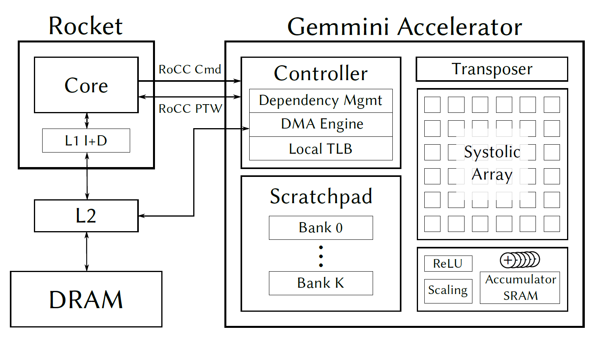

Gemmini
====================================

The Gemmini project is developing a full-system, full-stack DNN hardware exploration and evaluation platform.
Gemmini enables architects to make useful insights into how different components of the system and software stack (outside of just the accelerator itself) interact to affect overall DNN performance.

Check out `Gemmini's documentation <https://github.com/ucb-bar/gemmini/blob/master/README.md>`__ to learn how to generate, simulate, and profile DNN accelerators with Gemmini and Chipyard.

