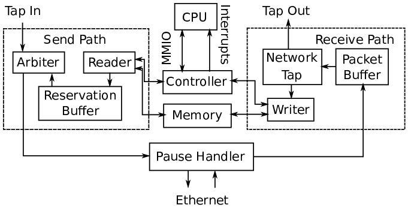

IceNet
======

IceNet is a library of Chisel designs related to networking. The main component
of IceNet is IceNIC, a network interface controller that is used primarily
in `FireSim <https://fires.im/>`_ for multi-node networked simulation.
A diagram of IceNet's microarchitecture is shown below.

There are four basic parts of the NIC: the :ref:`Controller`, which takes requests 
from and sends responses to the CPU; the :ref:`Send Path`, which reads data from
memory and sends it out to the network; the :ref:`Receive Path`, which receives
data from the network and writes it to memory; and, optionally,
the :ref:`Pause Handler`, which generates Ethernet pause frames for the purpose
of flow control.

Controller
----------

The controller exposes a set of MMIO registers to the CPU. The device driver
writes to registers to request that packets be sent or to provide memory
locations to write received data to. Upon the completion of a send request or
packet receive, the controller sends an interrupt to the CPU, which clears
the completion by reading from another register.

Send Path
---------

The send path begins at the reader, which takes requests from the controller
and reads the data from memory.

Since TileLink responses can come back out-of-order, we use a reservation
queue to reorder responses so that the packet data can be sent out in the
proper order.

The packet data then goes to an arbiter, which can arbitrate access to the
outbound network interface between the NIC and one or more "tap in" interfaces,
which come from other hardware modules that may want to send Ethernet packets.
By default, there are no tap in interfaces, so the arbiter simply passes
the output of the reservation buffer through.

Receive Path
------------

The receive path begins with the packet buffer, which buffers data coming
in from the network. If there is insufficient space in the buffer, it will
drop data at packet granularity to ensure that the NIC does not deliver
incomplete packets.

From the packet buffer, the data can optionally go to a network tap, which
examines the Ethernet header and select packets to be redirected from the NIC
to external modules through one or more "tap out" interfaces. By default, there
are no tap out interfaces, so the data will instead go directly to the writer,
which writes the data to memory and then sends a completion to the controller.

Pause Handler
-------------

IceNIC can be configured to have pause handler, which sits between the
send and receive paths and the Ethernet interface. This module tracks the
occupancy of the receive packet buffer. If it sees the buffer filling up, it
will send an `Ethernet pause frame <https://en.wikipedia.org/wiki/Ethernet_flow_control#Pause_frame>`_
out to the network to block further packets from being sent. If the NIC receives
an Ethernet pause frame, the pause handler will block sending from the NIC.

Linux Driver
------------

The default Linux configuration provided by `firesim-software <https://github.com/firesim/firesim-software>`_
contains an IceNet driver. If you launch a FireSim image that has IceNIC on it,
the driver will automatically detect the device, and you will be able to use
the full Linux networking stack in userspace.

Configuration
-------------

To add IceNIC to your design, add ``HasPeripheryIceNIC`` to your lazy module
and ``HasPeripheryIceNICModuleImp`` to the module implementation. If you
are confused about the distinction between lazy module and module
implementation, refer to :ref:`Cake Pattern`.

Then add the ``WithIceNIC`` config mixin to your configuration. This will
define ``NICKey``, which IceNIC uses to determine its parameters. The mixin
takes two arguments. The ``inBufFlits`` argument is the number of 64-bit flits
that the input packet buffer can hold and the ``usePauser`` argument determines
whether or not the NIC will have a pause handler.
