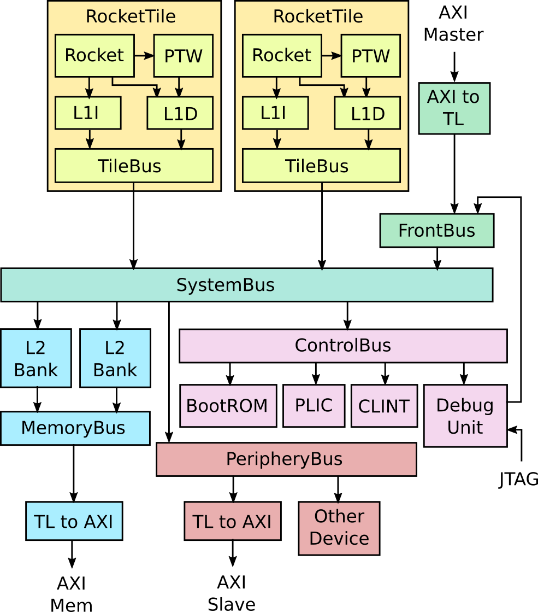

Rocket Chip
===========

Rocket Chip generator is an SoC generator developed at Berkeley and now supported by
SiFive. Chipyard uses the Rocket Chip generator as the basis for producing a RISC-V SoC.

`Rocket Chip` is distinct from `Rocket core`, the in-order RISC-V CPU generator.
Rocket Chip includes many parts of the SoC besides the CPU. Though Rocket Chip
uses Rocket core CPUs by default, it can also be configured to use the BOOM
out-of-order core generator or some other custom CPU generator instead.

A detailed diagram of a typical Rocket Chip system is shown below.

Tiles
-----

The diagram shows a dual-core ``Rocket`` system. Each ``Rocket`` core is
grouped with a page-table walker, L1 instruction cache, and L1 data cache into
a ``RocketTile``.

The ``Rocket`` core can also be swapped for a ``BOOM`` core. Each tile can
also be configured with a RoCC accelerator that connects to the core as a
coprocessor.

Memory System
-------------
The tiles connect to the ``SystemBus``, which connect it to the L2 cache banks.
The L2 cache banks then connect to the ``MemoryBus``, which connects to the
DRAM controller through a TileLink to AXI converter.

To learn more about the memory hierarchy, see :ref:`Memory Hierarchy`.

MMIO
----

For MMIO peripherals, the ``SystemBus`` connects to the ``ControlBus`` and ``PeripheryBus``.

The ``ControlBus`` attaches standard peripherals like the BootROM, the
Platform-Level Interrupt Controller (PLIC), the core-local interrupts (CLINT),
and the Debug Unit.

The BootROM contains the first stage bootloader, the first instructions to run
when the system comes out of reset. It also contains the Device Tree, which is
used by Linux to determine what other peripherals are attached.

The PLIC aggregates and masks device interrupts and external interrupts.

The core-local interrupts include software interrupts and timer interrupts for
each CPU.

The Debug Unit is used to control the chip externally. It can be used to load
data and instructions to memory or pull data from memory. It can be controlled
through a custom DMI or standard JTAG protocol.

The ``PeripheryBus`` attaches additional peripherals like the NIC and Block Device.
It can also optionally expose an external AXI4 port, which can be attached to
vendor-supplied AXI4 IP.

To learn more about adding MMIO peripherals, check out the :ref:`MMIO Peripheral`
section of :ref:`Adding an Accelerator/Device`.

DMA
---

You can also add DMA devices that read and write directly from the memory
system. These are attached to the ``FrontendBus``. The ``FrontendBus`` can also
connect vendor-supplied AXI4 DMA devices through an AXI4 to TileLink converter.

To learn more about adding DMA devices, see the :ref:`Adding a DMA port` section
of :ref:`Adding an Accelerator/Device`.
