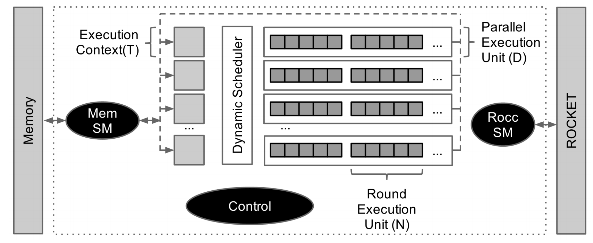

SHA3 RoCC Accelerator
===================================
The SHA3 accelerator is a basic RoCC accelerator for the SHA3 hashing algorithm.
We like using SHA3 in Chipyard tutorial content because it is a self-contained, simple
example of integrating a custom accelerator into Chipyard.

Introduction
-----------------------------------
Secure hashing algorithms represent a class of hashing functions that provide four attributes: ease
of hash computation, inability to generate the message from the hash (one-way property), inability
to change the message and not the hash (weakly collision free property), and inability to find
two messages with the same hash (strongly collision free property). The National Institute of
Standards and Technology (NIST) recently held a competition for a new algorithm to be added to
its set of Secure Hashing Algorithms (SHA). In 2012 the winner was determined to be the Keccak
hashing function and a rough specification for SHA3 was established. The algorithm operates on
variable length messages with a sponge function, and thus alternates between absorbing chunks of
the message into a set of state bits and permuting the state. The absorbing is a simple bitwise
XOR while the permutation is a more complex function composed of several operations, χ, θ, ρ,
π, ι, that all perform various bitwise operations, including rotations, parity calculations, XORs,
etc. The Keccak hashing function is parameterized for different sizes of state and message chunks
but for this accelerator we will only support the Keccak-256 variant with 1600 bits of state and
1088 bit message chunks. A diagram of the SHA3 accelerator is shown below.

Technical Details
------------------------------------
The accelerator is designed around three sub-systems, an
interface with the processor, an interface with memory, and
the actual hashing computation system. The interface
with the processor is designed using the ROCC interface for
coprocessors integrating with the RISC-V Rocket/BOOM
processor. It includes the ability to transfer two 64 bit
words to the co-processor, the request for a return value,
and a small field for the function requested. The accelerator
receives these requests using a ready/valid interface. The
ROCC instruction is parsed and the needed information is
stored into a execution context. The execution context contains
the memory address of the message being hashed, the memory address
to store the resulting hash in, the length of the message, and
several other control fields.

Once the execution context is valid the memory subsystem
then begins to fetch chunks of the message. The memory
subsystem is fully decoupled from the other subsystems
and maintains a single full round memory buffers.
The accelerators memory interface can provide a
maximum of one 64 bit word per cycle which corresponds
to 17 requests needed to fill a buffer (the size is dictated by
the SHA3 algorithm). Memory requests to fill these buffers
are sent out as rapidly as the memory interface can handle,
with a tag field set to allow the different memory buffers
requests to be distinguished, as they may be returned out of
order. Once the memory subsystem has filled a buffer the
control unit absorbs the buffer into the execution
context, at which point the execution context is free to
begin permutation, and the memory buffer is free to send
more memory requests.

After the buffer is absorbed, the hashing computation
subsystem begins the permutation operations. Once
the message is fully hashed, the hash is written to memory
with a simple state machine.

Using a SHA3 Accelerator
------------------------
Since the SHA3 accelerator is designed as a RoCC accelerator,
it can be mixed into a Rocket or BOOM core by overriding the
``BuildRoCC`` key. The config fragment is defined in the SHA3
generator. An example configuration highlighting the use of
this config fragment is shown here:

.. literalinclude:: ../../generators/chipyard/src/main/scala/config/RocketSha3Configs.scala
   :language: scala
   :start-after: DOC include start: Sha3Rocket
   :end-before: DOC include end: Sha3Rocket

The SHA3 example baremetal and Linux tests are located in the SHA3 repository.
Please refer to its `README.md <https://github.com/ucb-bar/sha3/blob/master/README.md>`_ for more information on how to run/build the tests.

