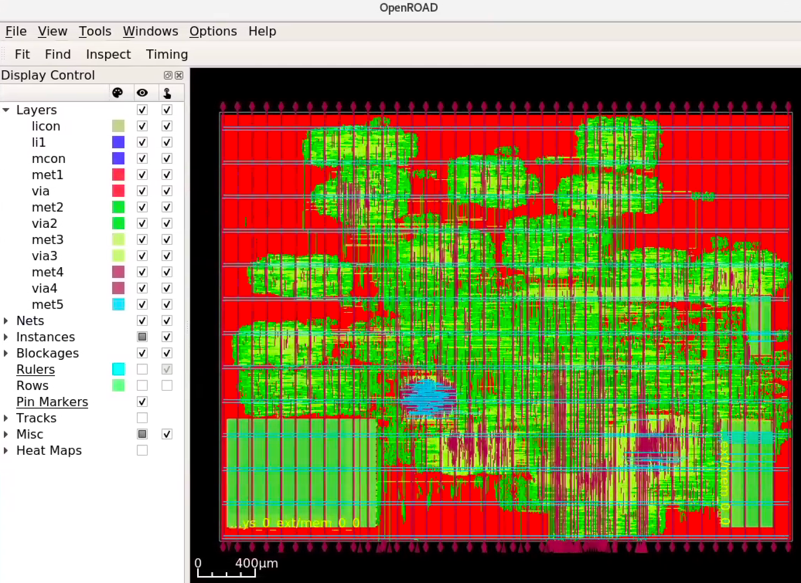
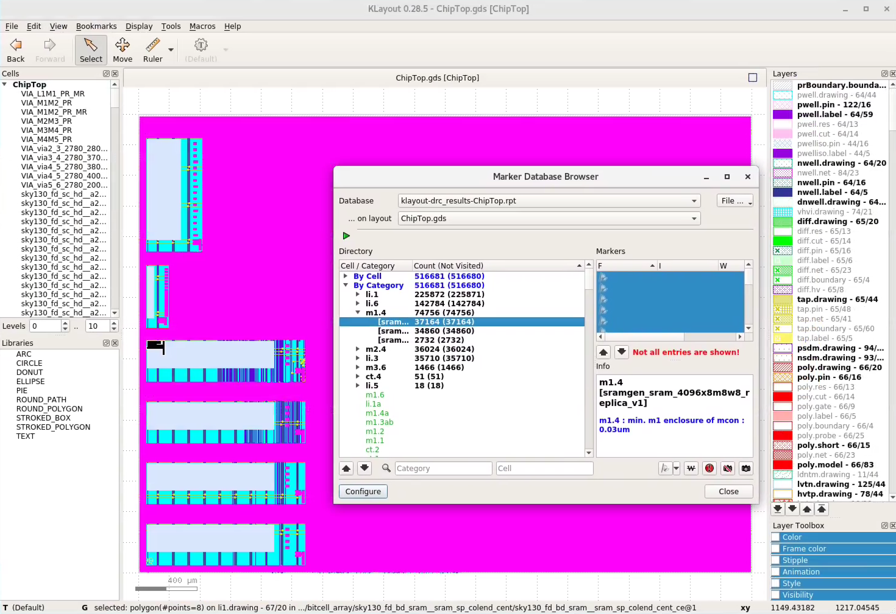

.. _sky130-openroad-tutorial:

Sky130 + OpenROAD Tutorial
==========================
The ``vlsi`` folder of this repository contains an example Hammer flow with the TinyRocketConfig from Chipyard. This example tutorial uses the built-in Sky130 technology plugin and OpenROAD tool plugin.

Project Structure
-----------------

This example gives a suggested file structure and build system. The ``vlsi/`` folder will eventually contain the following files and folders:

* ``Makefile``, ``sim.mk``, ``power.mk``

  * Integration of Hammer's build system into Chipyard and abstracts away some Hammer commands.

* ``build``

  * Hammer output directory. Can be changed with the ``OBJ_DIR`` variable.
  * Will contain subdirectories such as ``syn-rundir`` and ``par-rundir`` and the ``inputs.yml`` denoting the top module and input Verilog files.

* ``env.yml``

  * This file is not used in this tutorial, but is required for the commercial tool flow. A template file for tool environment configuration. Fill in the install and license server paths for your environment. For SLICE and BWRC affiliates, example environment configs are found `here <https://github.com/ucb-bar/hammer/tree/master/e2e/env>`__.

* ``example-vlsi-sky130``

  * Entry point to Hammer. Contains example placeholders for hooks.

* ``example-sky130.yml``, ``example-openroad.yml``, ``example-designs/sky130-openroad.yml``

  * Hammer IR for this tutorial. For SLICE and BWRC affiliates, an example Sky130 config is found `here <https://github.com/ucb-bar/hammer/tree/master/e2e/pdks>`__.

* ``example-design.yml``, ``example-asap7.yml``, ``example-tech.yml``

  * Hammer IR not used for this tutorial but provided as templates.

* ``generated-src``

  * All of the elaborated Chisel and FIRRTL.

* ``hammer-<vendor>-plugins``

  * Tool plugin repositories not used for this tutorial (they are provided in the hammer-vlsi package).

Prerequisites
-------------

* Python 3.9+
* OpenROAD flow tools (NOTE: tutorial may break with different tool versions):

  * **Yosys 0.27+3** (synthesis), install `using conda <https://anaconda.org/litex-hub/yosys>`__ or `from source <https://yosyshq.net/yosys/download.html>`__
  * **OpenROAD v2.0-7070-g0264023b6** (place-and-route), install `using conda <https://anaconda.org/litex-hub/openroad>`__ (note that GUI is disabled in conda package) or 
    `from source <https://github.com/The-OpenROAD-Project/OpenROAD/blob/master/docs/user/Build.md>`__ (git hash: 0264023b6c2a8ae803b8d440478d657387277d93)
  * **KLayout 0.28.5** (DEF to GDSII conversion, DRC), install `using conda <https://anaconda.org/litex-hub/klayout>`__ or `from source <https://www.klayout.de/build.html>`__
  * **Magic 8.3.376** (DRC), install `using conda <https://anaconda.org/litex-hub/magic>`__ or `from source <http://www.opencircuitdesign.com/magic/install.html>`__
  * **NetGen 1.5.250** (LVS), install `using conda <https://anaconda.org/litex-hub/netgen>`__ or `from source <http://www.opencircuitdesign.com/netgen/install.html>`__

* Sky130A PDK, install `using conda <https://anaconda.org/litex-hub/open_pdks.sky130a>`__ or `these directions  <https://github.com/ucb-bar/hammer/blob/master/hammer/technology/sky130>`__
* `Sram22 Sky130 SRAM macros  <https://github.com/rahulk29/sram22_sky130_macros>`__

  * These SRAM macros were generated using the `Sram22 SRAM generator  <https://github.com/rahulk29/sram22>`__ (still very heavily under development)

Quick Prerequisite Setup
^^^^^^^^^^^^^^^^^^^^^^^^
As of recently, most of the prerequisites of this tutorial may now be installed as conda packages.
The prerequisite setup for this tutorial may eventually be scripted, but for now the directions to set them up are below.
Note that we create a new conda environment for each tool because some of them have conflicting dependencies.

.. code-block:: shell

    # channel settings so openroad/klayout install properly
    conda config --set channel_priority true
    conda config --add channels defaults

    # download all files for Sky130A PDK
    conda create -c litex-hub --prefix ~/.conda-sky130 open_pdks.sky130a=1.0.399_0_g63dbde9
    # clone the SRAM22 Sky130 SRAM macros
    git clone https://github.com/rahulk29/sram22_sky130_macros ~/sram22_sky130_macros

    # install all VLSI tools
    conda create -c litex-hub --prefix ~/.conda-yosys yosys=0.27_4_gb58664d44
    conda create -c litex-hub --prefix ~/.conda-openroad openroad=2.0_7070_g0264023b6
    conda create -c litex-hub --prefix ~/.conda-klayout klayout=0.28.5_98_g87e2def28
    conda create -c litex-hub --prefix ~/.conda-signoff magic=8.3.376_0_g5e5879c netgen=1.5.250_0_g178b172

    # revert conda settings
    conda config --set channel_priority strict
    conda config --remove channels defaults

Initial Setup
-------------
In the Chipyard root, ensure that you have the Chipyard conda environment activated. Then, run:

.. code-block:: shell

    ./scripts/init-vlsi.sh sky130 openroad

to pull and install the plugin submodules. Note that for technologies other than ``sky130`` or ``asap7``, the tech submodule is cloned in the ``vlsi`` folder,
and for the commercial tool flow (set up by omitting the ``openroad`` argument), the tool plugin submodules are cloned into the ``vlsi`` folder.

Now navigate to the ``vlsi`` directory. The remainder of the tutorial will assume you are in this directory.
We will summarize a few files in this directory that will be important for the rest of the tutorial.

.. code-block:: shell

    cd ~chipyard/vlsi

example-vlsi-sky130
^^^^^^^^^^^^^^^^^^^
This is the entry script with placeholders for hooks. In the ``ExampleDriver`` class, a list of hooks is passed in the ``get_extra_par_hooks``. Hooks are additional snippets of python and TCL (via ``x.append()``) to extend the Hammer APIs. Hooks can be inserted using the ``make_pre/post/replacement_hook`` methods as shown in this example. Refer to the Hammer documentation on hooks for a detailed description of how these are injected into the VLSI flow.

example-sky130.yml
^^^^^^^^^^^^^^^^^^
This contains the Hammer configuration for this example project. Example clock constraints, power straps definitions, placement constraints, and pin constraints are given. Additional configuration for the extra libraries and tools are at the bottom.

Add the following YAML keys to the top of this file to specify the location of the Sky130A PDK and SRAM macros.

.. code-block:: yaml

    # all ~ should be replaced with absolute paths to these directories
    # technology paths
    technology.sky130.sky130A: ~/.conda-sky130/share/pdk/sky130A
    technology.sky130.sram22_sky130_macros: ~/sram22_sky130_macros

example-openroad.yml
^^^^^^^^^^^^^^^^^^^^
This contains the Hammer configuration for the OpenROAD tool flow.
It selects tools for synthesis (Yosys), place and route (OpenROAD), DRC (KLayout or Magic), and LVS (NetGen).

Add the following YAML keys to the top of this file to specify the locations of the tool binaries.
Note that this is not required if the tools are already on your PATH.

.. code-block:: yaml

    # all ~ should be replaced with absolute paths to these directories
    # tool binary paths
    synthesis.yosys.yosys_bin: ~/.conda-yosys/bin/yosys
    par.openroad.openroad_bin: ~/.conda-openroad/bin/openroad
    par.openroad.klayout_bin: ~/.conda-klayout/bin/klayout  # binary that OpenROAD calls for final GDS writeout
    drc.klayout.klayout_bin: ~/.conda-klayout/bin/klayout   # binary that runs for DRC step
    drc.magic.magic_bin: ~/.conda-signoff/bin/magic
    lvs.netgen.netgen_bin: ~/.conda-signoff/bin/netgen

Building the Design
--------------------

To elaborate the ``TinyRocketConfig`` and set up all prerequisites for the build system to push the design and SRAM macros through the flow:

.. code-block:: shell

    make buildfile tutorial=sky130-openroad

The command ``make buildfile`` generates a set of Make targets in ``build/hammer.d``.
It needs to be re-run if environment variables are changed.
It is recommended that you edit these variables directly in the Makefile rather than exporting them to your shell environment.

The ``buildfile`` make target has dependencies on both (1) the Verilog that is elaborated from all Chisel sources
and (2) the mapping of memory instances in the design to SRAM macros;
all files related to these two steps reside in the ``generated-src/chipyard.harness.TestHarness.TinyRocketConfig-ChipTop`` directory.
Note that the files in ``generated-src`` vary for each tool/technology flow.
This especially applies to the Sky130 Commercial vs OpenROAD tutorial flows
(due to the ``ENABLE_YOSYS_FLOW`` flag, explained below), so these flows should be run in separate
chipyard installations. If the wrong sources are generated, simply run ``make buildfile -B`` to rebuild all targets correctly.

For the sake of brevity, in this tutorial we will set the Make variable ``tutorial=sky130-openroad``,
which will cause additional variables to be set in ``tutorial.mk``, a few of which are summarized as follows:

* ``CONFIG=TinyRocketConfig`` selects the target generator config in the same manner as the rest of the Chipyard framework. This elaborates a stripped-down Rocket Chip in the interest of minimizing tool runtime.
* ``tech_name=sky130`` sets a few more necessary paths in the ``Makefile``, such as the appropriate Hammer plugin
* ``TOOLS_CONF`` and ``TECH_CONF`` select the approproate YAML configuration files, ``example-openroad.yml`` and ``example-sky130.yml``, which are described above
* ``DESIGN_CONF`` and ``EXTRA_CONFS`` allow for additonal design-specific overrides of the Hammer IR in ``example-sky130.yml``
* ``VLSI_OBJ_DIR=build-sky130-openroad`` gives the build directory a unique name to allow running multiple flows in the same repo. Note that for the rest of the tutorial we will still refer to this directory in file paths as ``build``, again for brevity.
* ``VLSI_TOP`` is by default ``ChipTop``, which is the name of the top-level Verilog module generated in the Chipyard SoC configs. By instead setting ``VLSI_TOP=Rocket``, we can use the Rocket core as the top-level module for the VLSI flow, which consists only of a single RISC-V core (and no caches, peripherals, buses, etc). This is useful to run through this tutorial quickly, and does not rely on any SRAMs.
* ``ENABLE_YOSYS_FLOW = 1`` is required for synthesis through Yosys. This reverts to the Scala FIRRTL Compiler so that unsupported multidimensional arrays are not generated in the Verilog.

Running the VLSI Flow
---------------------

Synthesis
^^^^^^^^^

.. code-block:: shell

    make syn tutorial=sky130-openroad

Post-synthesis logs and collateral are in ``build/syn-rundir``.

.. The raw quality of results data is available at ``build/syn-rundir/reports``, and methods to extract this information for design space exploration are a work in progress.

Place-and-Route
^^^^^^^^^^^^^^^
.. code-block:: shell

    make par tutorial=sky130-openroad

Note that sometimes OpenROAD freezes on commands following the ``detailed_route`` step,
so for now we recomment running place-and-route until the ``extraction`` step,
then re-starting the flow at this step. See the :ref:`VLSI/Sky130-OpenROAD-Tutorial:VLSI Flow Control` documentation
below for how to break up the flow into these steps.

After completion, the final database can be opened in an interactive OpenROAD session.
Hammer generates a convenient script to launch these sessions

.. code-block:: shell

    cd ./build/chipyard.harness.TestHarness.TinyRocketConfig-ChipTop/par-rundir
    ./generated-scripts/open_chip

Note that the conda OpenROAD package was compiled with the GUI disabled, so in order to view the layout,
you will need to install OpenROAD from source.

Below is the post-PnR layout for the TinyRocketConfig in Sky130 generated by OpenROAD.

Intermediate databases are written in ``build/par-rundir`` between each step of the ``par`` action,
These databases can be restored using the same ``open_chip`` script for debugging purposes.

.. code-block:: shell

    cd build/chipyard.harness.TestHarness.TinyRocketConfig-ChipTop/par-rundir
    ./generated_scripts/open_chip -h
    "
        Usage: ./generated-scripts/open_chip [-t] [openroad_db_name]

        Options
          openroad_db_name    : Name of database to load (default=latest)
          -t, --timing        : Load timing info (default=disabled because of slow load time)
          -h, --help          : Display this message
    "
    # load pre-global route database without timing information
    ./generated_scripts/open_chip pre_global_route

    # load post-clock tree database with timing inforamtion
    ./generated_scripts/open_chip -t post_clock_tree

Various reports, including timing reports, are found in ``build/par-rundir/reports``.

See the `OpenROAD tool plugin <https://github.com/ucb-bar/hammer/blob/master/hammer/par/openroad>`__ for the full list of OpenROAD tool steps and their implementations.

DRC & LVS
^^^^^^^^^

As a note, this tutorial has been run extensively through commercial signoff tools,
thus the open-source signoff flow is not stable or guaranteed to produce useful results.
We welcome any contributions to improving our  `KLayout tool plugin <https://github.com/ucb-bar/hammer/blob/master/hammer/drc/klayout>`__,
`Magic tool plugin <https://github.com/ucb-bar/hammer/blob/master/hammer/drc/magic>`__,
and `Netgen tool plugin <https://github.com/ucb-bar/hammer/blob/master/hammer/lvs/netgen>`__.

We recommend KLayout for DRC to produce readable results, but Magic may be selected in ``example-openroad.yml``
by uncommenting the line ``vlsi.core.drc_tool: "hammer.drc.magic"``.

To run DRC & LVS and view the results:

.. code-block:: shell

    make drc tutorial=sky130-openroad
    ./build/chipyard.harness.TestHarness.TinyRocketConfig-ChipTop/drc-rundir/generated-scripts/view_drc
    make lvs tutorial=sky130-openroad
    ./build/chipyard.harness.TestHarness.TinyRocketConfig-ChipTop/lvs-rundir/generated-scripts/view_lvs

Note that in ``sky130-openroad.yml`` we have set the following YAML keys:

.. code-block:: yaml

    drc.magic.generate_only: true
    lvs.netgen.generate_only: true

These keys cause the Hammer plugin to only generate all necessary scripts, without executing them with the respective tool.
This is because Magic and Netgen, as of the writing of this tutorial, do not have a database format that may be loaded interactively,
so to view the DRC/LVS results for debugging you must launch the tool interactively, then run DRC/LVS checks,
which is done by the ``generated-scripts/view_[drc|lvs]`` scripts. This is not the case for KLayout, which does have a loadable database format.

Below is the window you should see when loading the KLayout DRC results interactively. Note that most of these DRC errors are 
from special rules relating to Sky130 SRAMs, which have been verified separately. In the future the KLayout tool plugin should blackbox these
SRAM macros by default, but this feature does not exist yet.

VLSI Flow Control
^^^^^^^^^^^^^^^^^
Firt, refer to the :ref:`VLSI/Hammer:VLSI Flow Control` documentation. The below examples use the ``redo-par`` Make target to re-run only place-and-route. ``redo-`` may be prepended to any of the VLSI flow actions to re-run only that action.

.. code-block:: shell

      # the following two commands run the entire flow, using the pre_extraction
      #   database to save and reload a checkpoint of the design
      make par HAMMER_EXTRA_ARGS="--stop_after_step extraction"
      make redo-par HAMMER_EXTRA_ARGS="--start_before_step extraction"

      # the following two commands are equivalent because the extraction
      #   step immediately precedes the write_design step
      make redo-par HAMMER_EXTRA_ARGS="--start_after_step extraction"
      make redo-par HAMMER_EXTRA_ARGS="--start_before_step write_design"

      # example of re-running only floorplanning to test out a new floorplan configuration
      #   the "-p file.yml" causes file.yml to override any previous yaml/json configurations
      make redo-par \
        HAMMER_EXTRA_ARGS="--only_step floorplan_design -p example-designs/sky130-openroad.yml"

Documentation
-------------
For more information about Hammer's underlying implementation, visit the `Hammer documentation website <https://hammer-vlsi.readthedocs.io/en/latest/index.html>`__.

For details about the plugins used in this tutorial, check out the `OpenROAD tool plugin repo + README <https://github.com/ucb-bar/hammer/blob/master/hammer/par/openroad>`__
and `Sky130 tech plugin repo + README <https://github.com/ucb-bar/hammer/blob/master/hammer/technology/sky130>`__.
