# Chipyard 

## Tutorial & Lab

<!-- BWRC & Intel 22nm Edition --> 

## Overview

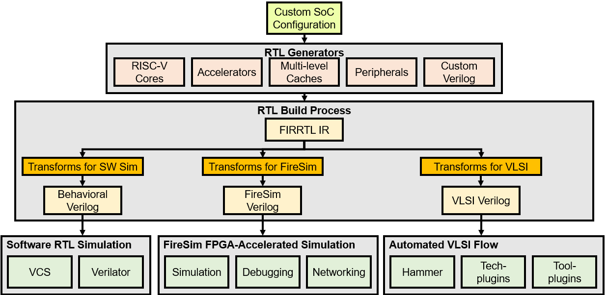

In this lab, we will explore the [Chipyard](https://github.com/ucb-bar/chipyard) framework. 

Chipyard is an integrated design, simulation, and implementation framework for open source hardware development developed here at UC Berkeley. It is open-sourced online and is based on the Chisel and FIRRTL hardware description libraries, as well as the Rocket Chip SoC generation ecosystem. It brings together much of the work on hardware design methodology from Berkeley over the last decade as well as useful tools into a single repository that guarantees version compatibility between the projects it submodules.

A designer can use Chipyard to build, test, and tapeout (manufacture) a RISC-V-based SoC. This includes RTL development integrated with Rocket Chip, cloud FPGA-accelerated simulation with FireSim, and physical design with the Hammer framework.

Chisel is the primary hardware description language used at Berkeley. It is a domain-specific language built on top of Scala. Thus, it provides designers with the power of a modern programming language to write complex, parameterizable circuit generators that can be compiled into synthesizable Verilog. You will be writing a few lines of basic Chisel code in this lab, however, it is NOT the focus of this lab. This lab aims to familarize you with the Chipyard framework as a whole.

Here are some resources to learn more about Chisel:
- [Chisel Website](https://www.chisel-lang.org/)
- [Chisel Bootcamp](https://github.com/freechipsproject/chisel-bootcamp)
- [Detailed Chisel API Documentation](https://www.chisel-lang.org/api/chisel3/latest/)
- [Intensivate's Chisel Learning Journey](https://github.com/Intensivate/learning-journey/wiki)

Students interested in designing accelerators and other IP (writing significant RTL) are especially encouraged to consult these resources. 

Throughout the rest of the course, we will be developing our SoC using Chipyard as the base framework. 
There is a lot in Chipyard so we will only be able to explore a part of it in this lab, but hopefully you will get a brief sense of its capabilities.
In particular, the lab provides a brief overview of Chipyard's diverse features, and then guides one through designing, verifying, and incorporating an accelerator into an SoC (via RoCC and MMIO interfaces).

<!-- We will simulate a Rocket Chip-based design at the RTL level, and then synthesize and place-and-route it in Inten 16nm technology using the Hammer back-end flow. -->

<!-- 


## Access & Setup

It should be clear by now this isn't going like most other courses. Most don't require signing non-disclosure agreements, or setting up a long string of IT infrastructure. Such is chip-design life. Running the Intel16 ChipYard lab will require access to a handful of BWRC research resources, including:

* Command-line access to the BWRC Linux servers
* Membership in the BWRC Linux `intech22` group
* The BWRC-Repo GitLab instance at [https://bwrcrepo.eecs.berkeley.edu](https://bwrcrepo.eecs.berkeley.edu)
* The course group in said GitLab instance, at [https://bwrcrepo.eecs.berkeley.edu/EE290C_EE194_intech22](https://bwrcrepo.eecs.berkeley.edu/EE290C_EE194_intech22)
* The corresponding Intel22 technology group at [https://bwrcrepo.eecs.berkeley.edu/intech22](https://bwrcrepo.eecs.berkeley.edu/intech22)

If you don't have access to any of these, this isn't going to work yet. As of this lab's writing most student setup is in progress; if yours doesn't work yet, take a minute to bug your peers about whether theirs does, and perhaps bug your instructors or admins for good measure. 

This lab also presumes much of its GitLab interaction will occur via SSH. While setting up git to use HTTPS instead is possible by editing several lab materials, we recommend instead setting up [SSH keys](https://bwrcrepo.eecs.berkeley.edu/profile/keys) on the BWRC-Repo GitLab instance. 

-->

## Getting Started

First, we will need to setup our Chipyard workspace. All of our work will occur on the BWRC compute cluster. Make sure you have access and can connect to the BWRC compute cluster before starting this lab. For this lab, and the course in general, please work in the `/tools/C/<your username>` directory, where you should use your EECS IRIS account username. If you do not see a directory under your username, contact [Brian Richards](bcr@berkeley.edu). <b>DO NOT</b> work out of the home directory

0) SSH into a BWRC login server: `bwrcrdsl-#.eecs.berkeley.edu` (Make sure you have the [campus VPN](https://security.berkeley.edu/services/bsecure/bsecure-remote-access-vpn) on, if accessing the BWRC cluster off campus.)

1) Run 
```
 <your username>@bwrcrdsl-#:/tools/C/<your username> $ source /tools/C/ee290-dev-sp23/ee290-tools-env.sh
```

This script is responsible for setting up the tools and environment used in this lab (and more generally by the course). Specifically, it does the following right now:
1. Conda is an open-source package and environment management system that allows you to quickly install, run, and update packages and their dependencies. We activate the base conda environment for the course's conda instance. 
1. We use commercial tools such as VCS from a common installation location on the BWRC compute cluster. We add this location to the path and source relevant licenses.

TAs will manage further changes to this script to simplify environment/workflow setup in the coming weeks.


<b>You will need to source this script in every new terminal & at the start of every work session.</b> 

2) Clone the lab chipyard repo <a href="https://github.com/ucb-bar/sp23-chipyard-lab-dev/tree/lab-dev">here</a>.
```
 <your username>@bwrcrdsl-#:/tools/C/<your username> $ git clone https://github.com/ucb-bar/sp23-chipyard-lab-dev.git
```

3) Run
```
 <your username>@bwrcrdsl-#:/tools/C/<your username> $cd sp23-chipyard-lab-dev
```

Optionally, set the repo path as an [environment variable](https://www.geeksforgeeks.org/environment-variables-in-linux-unix/) by running `export chipyard=/tools/C/<your username>/sp23-chipyard-lab-dev`. We will be referring to the repo path as `$chipyard` from now on. If you do not wish to set up this environment variable, you will need to write out `/tools/C/<your username>/sp23-chipyard-lab-dev` every time we use `$chipyard`.

4) Run

```
 <your username>@bwrcrdsl-#:/tools/C/<your username>/sp23-chipyard-lab-dev $ git checkout lab-dev
```
to switch to the lab branch.

5) Run 
```
<your username>@bwrcrdsl-#:/tools/C/<your username>/sp23-chipyard-lab-dev $ conda activate /tools/C/raghavgupta/intech22/sp23/chipyard-lab-sp23/.conda-env
```

In Chipyard, we use the Conda package manager to help manage system dependencies. Conda allows users to create an “environment” that holds system dependencies like `make`, `gcc`, etc. We've also installed a pre-built RISC-V toolchain into it. We want to ensure that everyone in the class is using the same version of everything, so everyone will be using the same conda environment by activating the environment specified above. <b>You will need to do this in every new terminal & at the start of every work session.</b>


6) Run 

```
<your username>@bwrcrdsl-#:/tools/C/<your username>/sp23-chipyard-lab-dev $ ./scripts/init-submodules-no-riscv-tools.sh

```

The `init-subodules-no-riscv-tools.sh` script will initialize and checkout all of the necessary `git submodules`. This will also validate that you are on a tagged branch, otherwise it will prompt for confirmation. When updating Chipyard to a new version, you will also want to rerun this script to update the submodules. Using git directly will try to initialize all submodules; this is not recommended unless you expressly desire this behavior.

`git submodules` allow you to keep other Git repositories as subdirectories of another Git repository. For example, the above script initiates the `rocket-chip` submodule which is it's own Git repository that you can look at <a href="https://github.com/chipsalliance/rocket-chip/tree/44b0b8249279d25bd75ea693b725d9ff1b96e2ab">here</a>. If you look at the `.gitmodules` file at `$chipyard`, you can see
```
[submodule "rocket-chip"]
	path = generators/rocket-chip
	url = https://github.com/chipsalliance/rocket-chip.git
```
which defines this behavior. Read more about `git submodules` [here](https://git-scm.com/book/en/v2/Git-Tools-Submodules).

7) Run 
```
<your username>@bwrcrdsl-#:/tools/C/<your username>/sp23-chipyard-lab-dev/ $ source ./env.sh
```

An `env.sh` file should exist in the top-level repository (`$chipyard`). This file sets up necessary environment variables such as `PATH` for the current Chipyard repository. This is required by future Chipyard steps such as the `make` system to function correctly.

Over the course of the semester, we will find ourselves working with different Chipyards, such as one for this lab, and one for the SoCs we build this semester.

<!--- An `env.sh` file should exist in the top-level repository (`$chipyard`). This file sets up necessary environment variables such as needed for future Chipyard steps (needed for the `make` system to work properly). Once the script is run, the `PATH`, `RISCV`, and `LD_LIBRARY_PATH` environment variables will be set properly for the toolchain requested. -->

You should source the `env.sh` file in the Chipyard repository you wish to work in <!--- in your [`.bashrc`](https://www.digitalocean.com/community/tutorials/bashrc-file-in-linux) or equivalent environment setup file to get the proper variables, or directly include it in your current environment --> by **running the above command every time you open a new terminal or start a new work session**.

## Chipyard Repo Tour

> <b>You will mostly be working out of the `generators/` (for designs), `sims/vcs/` (for simulations)* and `vlsi/` (for physical design) directories.</b> 
However, we will still give a general repo tour to get you familiar with Chipyard as a whole.


###### *VCS is a propietory simulation tool provided by Synopsys while Verilator is an open-source tool. There are some subtle differences form the user perspective, but VCS is usually faster so we'll be using that throuhgout the course. Everthing done with VCS can easily also be done in Verilator (the subdirectory structure is the same as well).
```
 $chipyard/
  generators/ <------- library of Chisel generators
    chipyard/
    sha3/
  sims/ <------------- utilities for simulating SoCs
    vcs/
    verilator/
    firesim/
  fpga/
  software/
  vlsi/ <------------- HAMMER VLSI Flow
  toolchains/ <------- RISC-V Toolchain
```

You may have noticed while initializing your Chipyard repo that there are many submodules. Chipyard is built to allow the designer to generate complex configurations from different projects including the in-order Rocket Chip core, the out-of-order BOOM core, the systolic array Gemmini, and many other components needed to build a chip.
Thankfully, Chipyard has some great documentation, which can be found 
[here](https://chipyard.readthedocs.io/en/latest/). 

You can find most of these in the `$chipyard/generators/` directory.
All of these modules are built as generators (a core driving point of using Chisel), which means that each piece is parameterized and can be fit together with some of the functionality in Rocket Chip (check out the [TileLink and Diplomacy references](https://chipyard.readthedocs.io/en/stable/TileLink-Diplomacy-Reference/index.html) in the Chipyard documentation).

### SoC Architecture 

<table border-"0">
  <tr>
    <td></td>
    <td>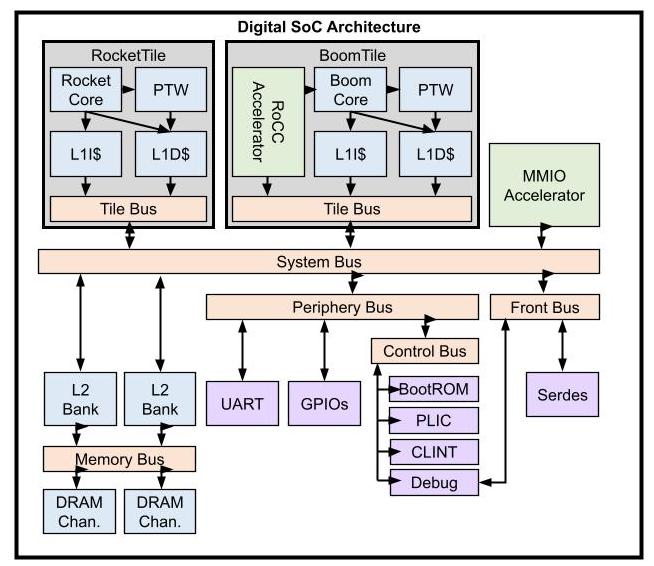</td>
  </tr>
</table>
 
          

<table border="0">
 <tr>
    <td>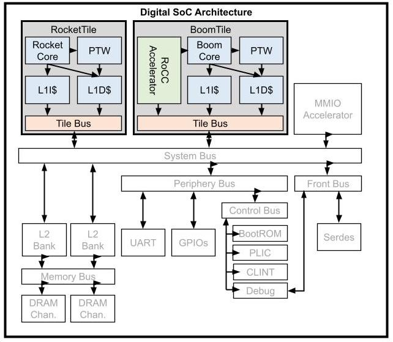</td>
    <td>
      <h2>Tiles</h2>
      <ul>
        <li> A tile is the basic unit of replication of a core and its associated hardware
        <li> Each tile contains a RISC-V core and can contain additional hardware such as private caches, page table walker, TileBus (specified using configs)
        <li> Several varieties of cores (<a href="https://chipyard.readthedocs.io/en/stable/Generators/Rocket.html">Rocket</a>, <a href="https://chipyard.readthedocs.io/en/stable/Generators/BOOM.html">BOOM</a>, <a href="https://chipyard.readthedocs.io/en/stable/Generators/Sodor.html">Sodor</a>, <a href="https://chipyard.readthedocs.io/en/stable/Generators/CVA6.html">CVA-6 (Ariane)</a>, <a href="https://chipyard.readthedocs.io/en/stable/Generators/Ibex.html">Ibex</a> supported)
        <li> Interface supports integrating your own RISC-V core implementation
      </ul>
    </td>
  </tr>

  <tr>
    <td>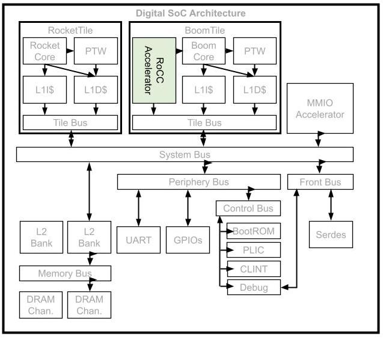</td>
    <td>
      <h2>RoCC Accelerators</h2>
      <ul>
        <li> Tightly-coupled accelerator interface
        <li> Attach custom accelerators to Rocket or BOOM cores
        <li> Example: <a href="https://github.com/ucb-bar/gemmini/tree/c47cb7f3eb5c18390f176f3a53c43c8546d487d2">GEMMINI accelerator</a> 
      </ul>
    </td>
  </tr>


  <tr>
    <td>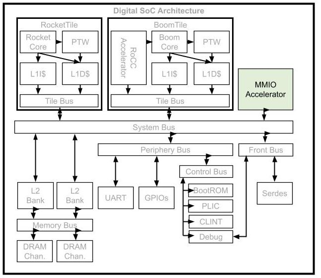</td>
    <td>
      <h2>MMIO Accelerators</h2>
      <ul>
        <li> Controlled by memory-mapped IO registers
        <li> Support DMA to memory system
        <li> Examples: <a href="http://nvdla.org/">Nvidia NVDLA accelerator</a> & <a href="https://chipyard.readthedocs.io/en/stable/Generators/fft.html">FFT accelerator generator </a>
      </ul>
    </td>
  </tr>

  <tr>    
    <td>
      <table border="0">
        <tr>
        </tr>
        <tr>
          <td>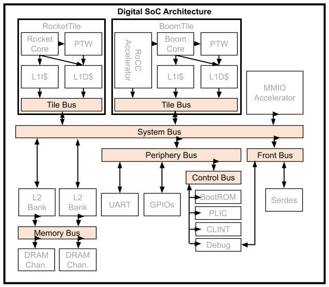</td>
        </tr>
        <tr>
          <td>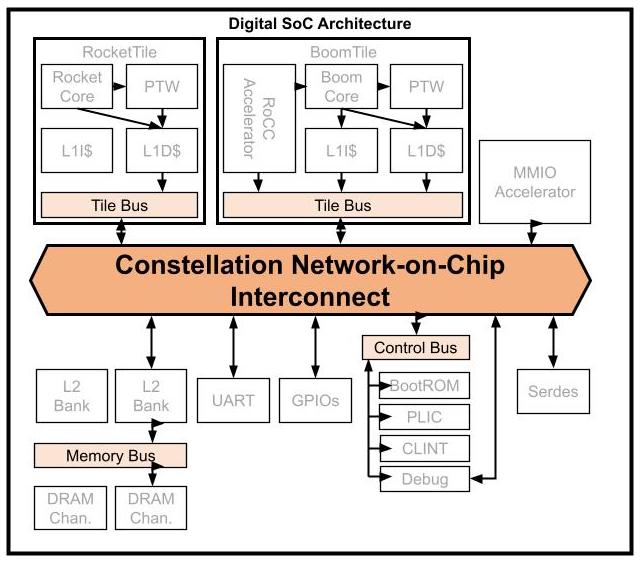</td>
        </tr>
      </table>
    </td>
    <td>
      <table border="0">
        <tr>
          <td><h2>Chip Interconnect</h2></td>
        </tr>
        <tr>
          <td>
            <h3>TileLink Standard</h3>
            <ul>
              <li> TileLink is an open-source chip-scale interconnect standard (i.e., a protocol defining the communication interface between different modules on a chip)
              <li> Comparable to industry-standard protocols such as AXI/ACE
              <li> Supports multi-core, accelerators, peripherals, DMA, etc.
            </ul>
            <h3>Interconnect IP in Chipyard</h3>
            <ul>
              <li> Library of TileLink RTL generators provided in RocketChip
              <li> RTL generators for crossbar-based buses
              <li> Width-adapters, clock-crossings, etc.
              <li> Adapters to AXI4, APB
            </ul>
          </td>
        </tr>
        <tr>
          <td>
            <h3>Constellation</h3>
            <ul>
              <li> A parameterized Chisel generator for SoC interconnects
              <li> Protocol-independent transport layer
              <li> Supports TileLink, AXI-4
              <li> Highly parameterized
              <li> Deadlock-freedom
              <li> Virtual-channel wormhole-routing
            </ul>
          </td>
        </tr>
      </table>
    </td>
  </tr>

  <tr>
    <tr>
      <td>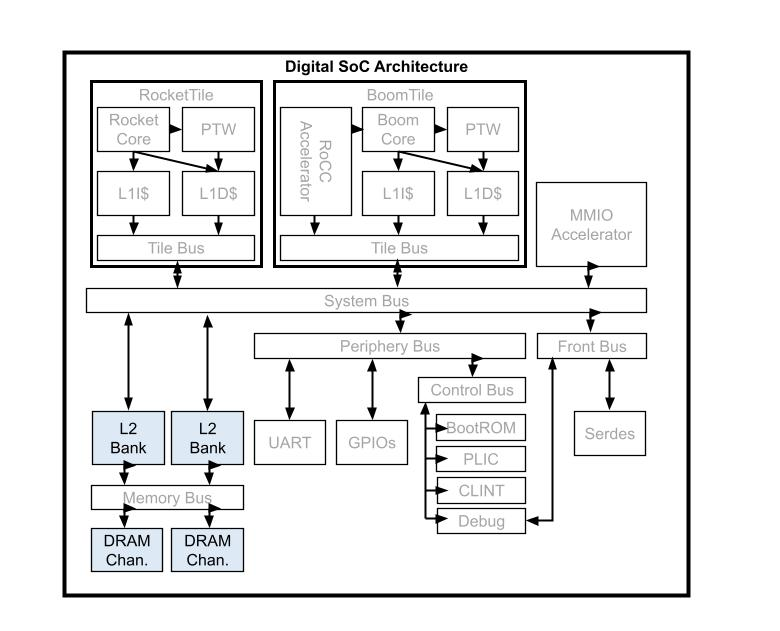</td>
      <td>
        <h2>Shared Memory</h2>
        <ul>
          <li> Open-source L2 cache that communicates over TileLink (developed by SiFive, iykyk)
          <li> Directory-based coherence with MOESI-like protocol
          <li> Configurable capacity/banking
          <li> Support broadcast-based coherence in no-L2 systems
          <li> Support incoherent memory systems
        </ul>
        <h2>DRAM</h2>
        <ul>
          <li> AXI-4 DRAM interface to external memory controller
          <li> Interfaces to DRAM simulators such as DRAMSim/FASED
        </ul>
      </td>
    </tr>
  </tr>

  <tr>
    <td>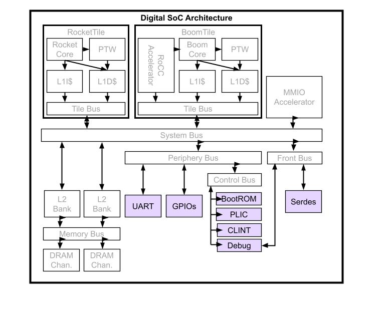</td>
    <td>
      <h2>Peripherals and IO</h2>
      <ul>
        <li>  <a href="https://docs.google.com/document/d/13rCqMM0qARjcLTrkwqlTzNClU-cxjUnZE0jHnIoe4UU/edit?usp=sharing">Chipyard Peripheral User Manual </a>  put together by Yufeng Chi who took the Sp22 iteration of this class. This document is a living document, so feel to add comments on sections that you don't understand/woud like to see added. 
        <li> Open-source RocketChip + SiFive blocks:
        <ul>
          <li> Interrupt controllers
          <li> JTAG, Debug module, BootROM
          <li> UART, GPIOs, SPI, I2C, PWM, etc.
        </ul>
        <li> TestChipIP: useful IP for test chips
        <ul>
          <li> Clock-management devices
          <li> SerDes
          <li> Scratchpads
        </ul>
       <li>Documentations of the peripheral devices can be found <a href="https://drive.google.com/file/d/1aDYtmHgG30Gy591TaNlya2rcc54nn9gZ/view?usp=sharing">here</a></li>
      </ul>
    </td>
  </tr>

</table>

<table border-"0">
  <tr>
    <td>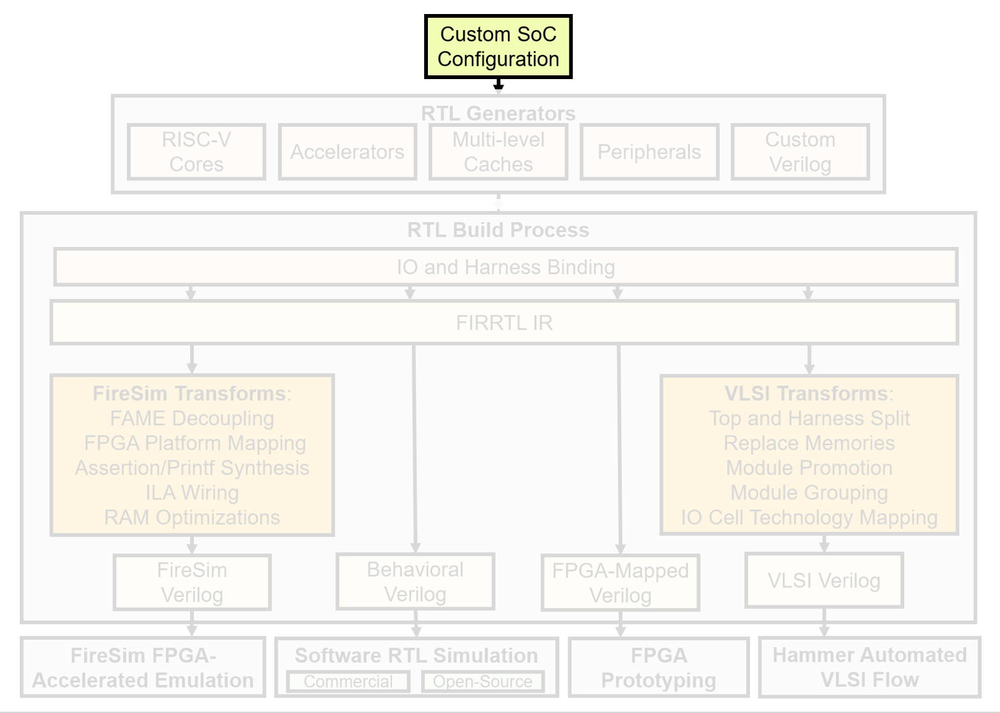</td>
    <td>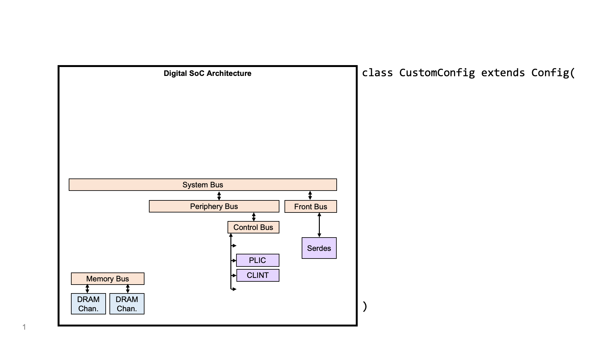</td>
  </tr>
</table>


## Config Exercise
Configs desribe what goes into our final ystem and what paramters our designs are elaborated with. You can find the configs in `$chipyard/generators/chipyard/src/main/scala/config`.

Look at the configs located in `$chipyard/generators/chipyard/src/main/scala/config/RocketConfigs.scala`, specifically `RocketConfig`

```
class RocketConfig extends Config(
  new freechips.rocketchip.subsystem.WithNBigCores(1) ++         // single rocket-core
  new chipyard.config.AbstractConfig)                            // builds one on top of another, so the single rocket-core is built on top of the AbstractConfig
```

<table border-"0">
  <tr>
    <td>
    RocketConfig is part of the "Digital System configuration" depicted below. It is built on top of the AbstractConfig which contains the config fragments (each line like <code>freechips.rocketchip.subsystem.WithNBigCores(1)</code> that adds something to the overall system is called a config fragment) for IO Binders and Harness Binders (depicted below).
    </td>
    <td>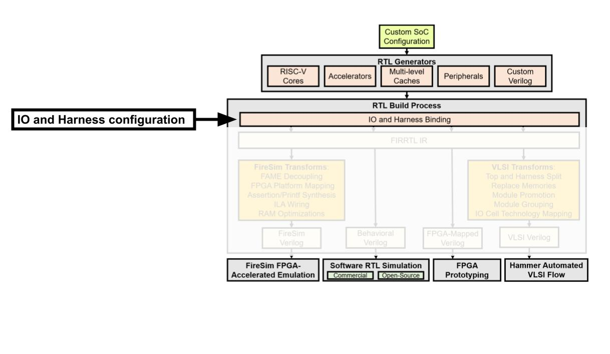</td>
  </tr>
</table>


<table border-"0">
  <tr>
    <td>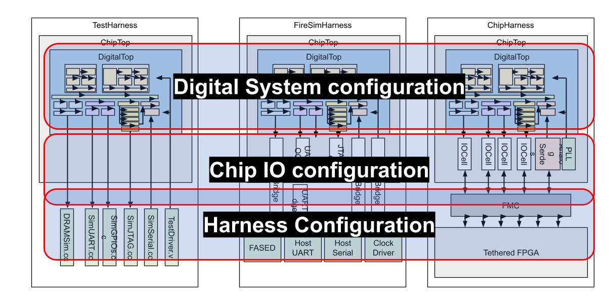</td>
    <td>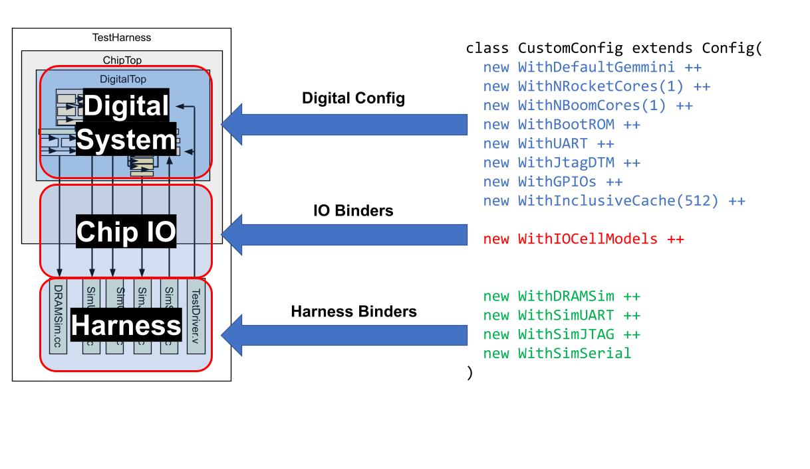</td>
  </tr>
</table>

<table>
  <tr>
    <th>Question</th>
    <th>Answer</th>
    <th>How we found the answer?</th>
  </tr>
  <tr>
    <td>Is UART enabled? If so, which config fragments enabled it?</td>
    <td>Yes; <code>chipyard.config.WithUART</code>,  <code>chipyard.iobinders.WithUARTIOCells</code>,  <code>chipyard.harness.WithUARTAdapter</code>.</td>
    <td>We grep for <code>AbstractConfig </code> in <code> $chipyard/generators/chipyard/src/main/scala/</code>and find <code>AbstractConfig</code> at <code>$chipyard/generators/chipyard/src/main/scala/config/AbstractConfig.scala</code>. We search for <code>UART</code> and find the corresponding config fragments.</td>
  </tr>
  <tr>
    <td>How many bytes are in a block for the L1 DCache? How many sets are in the L1 DCache? Ways?</td>
    <td>64 Block Bytes, 64 Sets, 4 Ways</td>
    <td>We don't see anything about L1 DCaches in <code>AbstractConfig</code>We grep for <code>WithNBigCores</code> at <code>$chipyard/generators/rocket-chip/src/main/scala/</code>. We find it in <code>$chipyard/generators/rocket-chip/src/main/scala/subsystem/Configs.scala</code> We see that the fragment instantiates a dcache with <code>DCacheParams</code> We notice it passes in <code>CacheBlockBytes</code> to blockBytes. So, we grep for <code>CacheBlockBytes</code> in <code>$chipyard/generators/rocket-chip/src/main/scala/</code> and see <pre><code>src/main/scala/subsystem/BankedL2Params.scala:case object CacheBlockBytes extends Field[Int](64)</code></pre> Then, we grep for <code>DCacheParams</code> and find it in<code>$chipyard/generators/rocket-chip/src/main/scala/rocket/HellaCache.scala</code> where we find the <code>nSets</code> and <code>nWays</code> fields</td>
  </tr>
  <tr>
    <td>Is there an L2 used in this config? What size?</td>
    <td>Yes. 1 bank, 8 ways, 512Kb.</td>
    <td>We once again start looking at <code> RocketConfig</code> which leads us to <code>AbstractConfig</code>. Looking at the comments of the various config fragments we see the comment <code> // use Sifive L2 cache</code> next to <code> new freechips.rocketchip.subsystem.WithInclusiveCache ++</code> (You can read more about SiFive <a href="https://www.sifive.com/">here</a>). We could have grepped in the generators directory for <code>WithInclusiveCache</code> or noticed that a <code>sifive-cache</code> submodule existed under <code>$chipyard/generators</code>. Navigating through it we eventually find the <code>WithInclusiveCache</code> class at <code>block-inclusivecache-sifive/design/craft/inclusivecache/src/Configs.scala</code>.</td>

  </tr>
</table>

Inspect `TinyRocketConfig` & answer the following questions. You should be able to find the answers or clues to the answers by grepping in `$chipyard/generators/chipyard/src/main/scala/` or `$chipyard/generators/rocket-chip/src/main/scala/`.

**1. How many bytes are in a block for the L1 DCache? How many sets are in the L1 DCache? Ways?**

**2. How many bytes are in a block for the L1 ICache? How many sets are in the L1 ICache? Ways?**

**3. Is there a L2 cache? If so, what are the dimensions?**

**4. Is UART enabled?**

**5. Does this config include a FPU (floating point unit)?**

**6. Does this config include a multiple-divide pipeline?**


<!---
You can look at examples of how your own Chisel modules or verilog black-box modules can be integrated into a Rocket Chip-based SoC in `$chipyard/generators/chipyard/src/main/scala/example`.
-->


## Running Some Commands

Let's run some commands! 

> *So far, we have been working on login servers. From this point on, we will be running some more compute-intensive commands on compute servers. Prepend all compute heavy commands (everything ran in the `vlsi/` directory & `sims/` directories) with `bsub -Is -q ee194` This submits the job to a special queue of compute servers for the class so we don't crash the login servers and mess up ongoing research work (or cause each other to lose valuable work :))* 

We'll be running the `CONFIG=RocketConfig` config (the `-j16` executes the run with more threads). All commands should be run in `$chipyard/sims/vcs`. Run
```
<your username>@bwrcrdsl-#:$chipyard/sims/vcs $ bsub -Is -q ee194 make CONFIG=RocketConfig -j16
```
> *Notes: [error] `Picked up JAVA_TOOL_OPTIONS: -Xmx8G -Xss8M -Djava.io.tmpdir=` is not a real error. You can safely ignore it.*

[FIRRTL](https://github.com/chipsalliance/firrtl) is used to translate Chisel source files into another representation--in this case, Verilog. Without going into too much detail, FIRRTL is consumed by a FIRRTL compiler (another Scala program) which passes the circuit through a series of circuit-level transformations. An example of a FIRRTL pass (transformation) is one that optimizes out unused signals. Once the transformations are done, a Verilog file is emitted and the build process is done. You can think of FIRRTL as an HDL version of LLVM if you are familar with LLVM (depicted below).

<table border-"0">
  <tr>
    <td>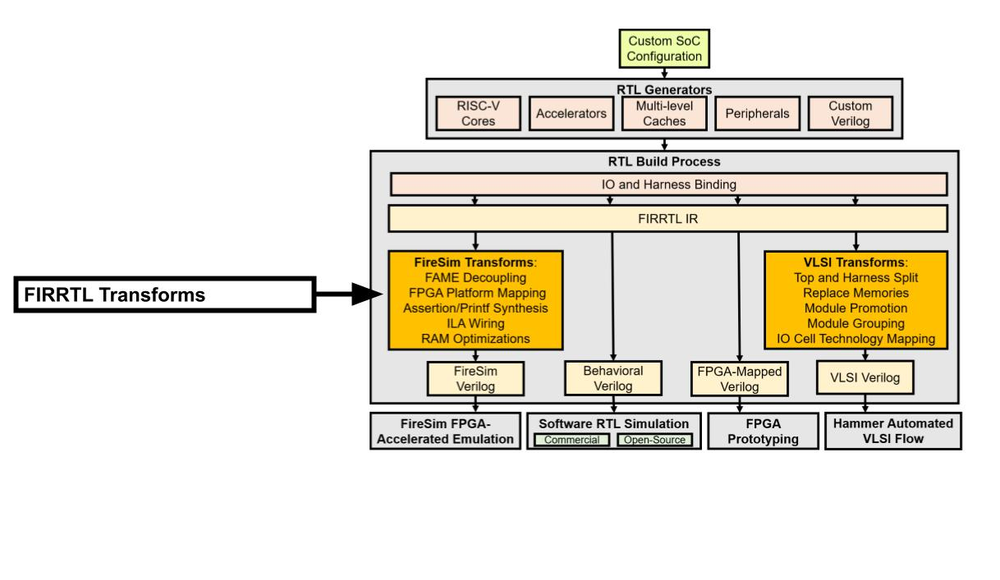</td>
    <td>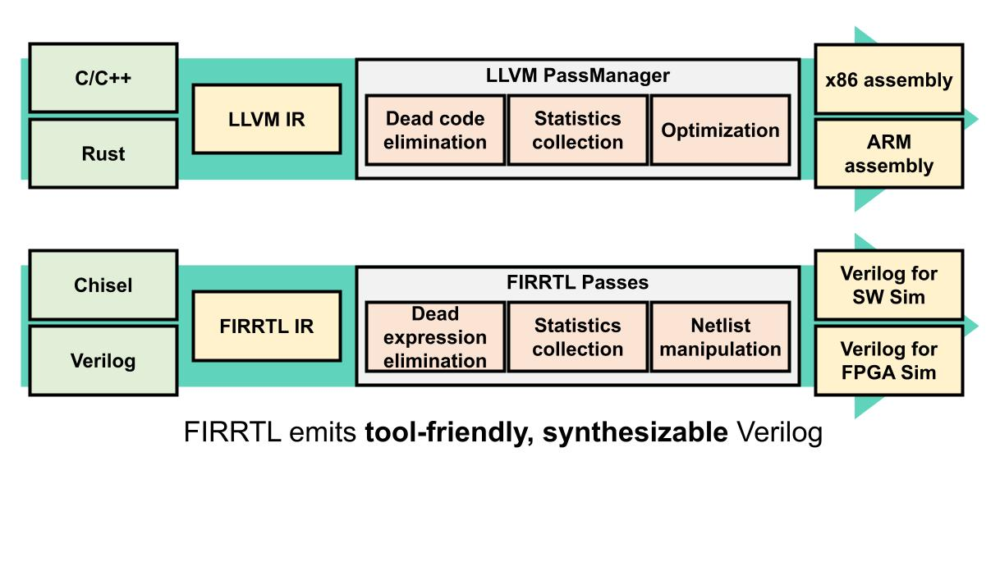</td>
  </tr>
</table>

After the run is done (can take ~20 minutes), check the `$chipyard/sims/vcs/generated-src` folder. Find the directory of the config that you ran and you should see the following files:
- `XXX.top.v`: Synthesizable Verilog source
- `XXX.harness.v`: TestHarness
- `XXX.dts`: device tree string
- `XXX.memmap.json`: memory map

Answer the following questions:

**1. Looking only at the emitted files, how many bytes are in a block for the L1 DCache? How many sets are in the L1 DCache?**

**2. Looking only at the emitted files, how many bytes are in a block for the L1 ICache? How many sets are in the L1 ICache?**

**3. Try to find the top-level verilog modules that correspond to the ICache/DCache? What are they called? *Hint: what modules look like they represent memories?***


## Chipyard Simulation

Simple RISCV test can be found under `$RISCV/riscv64-unknown-elf/share/riscv-tests/isa/`and can be run as:
```
<your username>@bwrcrdsl-#:$chipyard/sims/vcs $ bsub -Is -q ee194 make run-binary CONFIG=RocketConfig BINARY=$RISCV/riscv64-unknown-elf/share/riscv-tests/isa/rv64ui-p-simple
```

**1. What are the last 10 lines of the `.out` file generated by the assembly test you ran? It should include the *** PASSED *** flag.**

In summary, when we run something like: 
```
<your username>@bwrcrdsl-#:$chipyard/sims/vcs $  bsub -Is -q ee194 make run-binary CONFIG=RocketConfig BINARY=$RISCV/riscv64-unknown-elf/share/riscv-tests/isa/rv64ui-p-simple
```
The first command will elaborate the design and create Verilog.
This is done by converting the Chisel code, embedded in Scala, into a FIRRTL intermediate representation which is then run through the FIRRTL compiler to generate Verilog.
Next it will run VCS to build a simulator out of the generated Verilog that can run RISC-V binaries.
The second command will run the test specified by `BINARY` and output results as an `.out` file.
This file will be emitted to the `$chipyard/sims/vcs/output/` directory.

Many Chipyard Chisel-based design looks something like a Rocket core connected to some kind of "accelerator" (e.g. a DSP block like an FFT module).
When building something like that, you would typically build your "accelerator" generator in Chisel, and unit test it using ChiselTesters.
You can then write integration tests (eg. a baremetal C program) which can then be simulated with your Rocket Chip and "accelerator" block together to test end-to-end system functionality. 
Chipyard provides the infrastructure to help you do this for both VCS (Synopsys) and Verilator (open-source). The same infrastructure enables a few other applications as depicted below.

<table border-"0">
  <tr>
    <td>

- <b>SW RTL Simulation:</b> RTL-level simulation with VCS or Verilator. If you design anything with Chipyard, you should be running SW RTL simulation to test. 
- <b>Hammer VLSI flow:</b> Tapeout a custom config in some process technology.
- <b>FPGA prototyping:</b> Fast, non-deterministic prototypes (we won't be doing this in this class).
- <b>FireSim:</b> Fast, accurate FPGA-accelerated simulations (we won't be using this in this class, but if you're curious about FireSim, check out its documentation [here](https://fires.im/) and feel free to reach out to a TA to learn more).

    <td>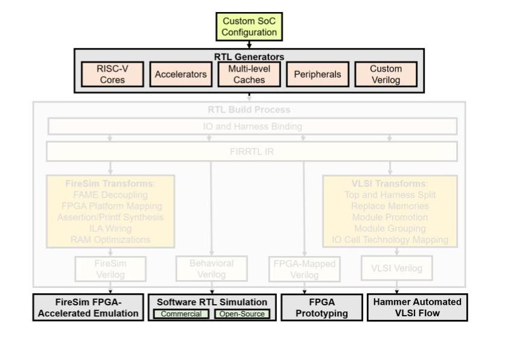</td>
  </tr>
</table>

## In summary...

<table border-"0">
  <tr>
    <td>

- <b>Configs</b>: Describe parameterization of a multi-generator SoC.
- <b>Generators</b>: Flexible, reusable library of open-source Chisel generators (and Verilog too).
- <b>IOBinders/HarnessBinders</b>: Enable configuring IO strategy and Harness features.
- <b>FIRRTL Passes</b>: Structured mechanism for supporting multiple flows.
- <b>Target flows</b>: Different use-cases for different types of users.</td>
    <td>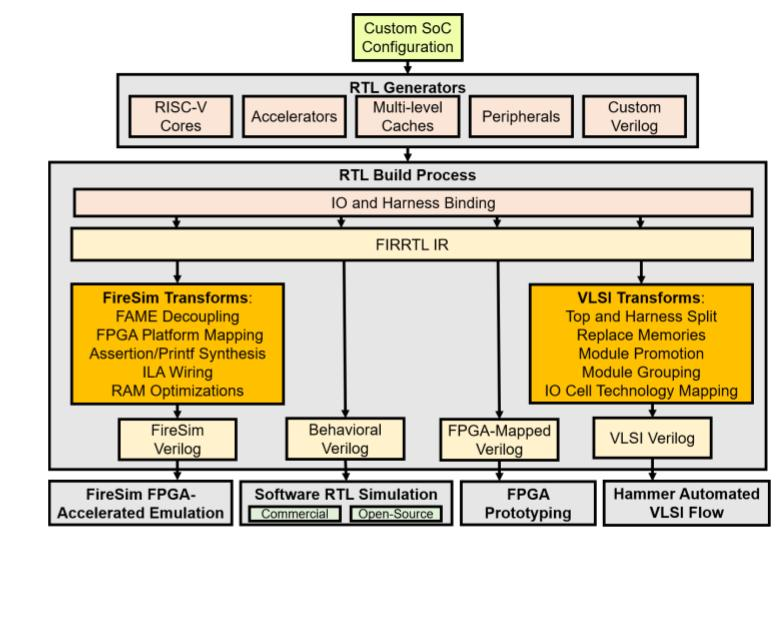</td>
  </tr>
</table>

### [Optional] More Complicated Configs & Tests

Complete this section if you want to see some more complicates systems. Navigate to `$chipyard/generators/chipyard/src/main/scala/config/TutorialConfigs.scala`. We'll be running the `CONFIG=TutorialNoCConfig` config whichs adds one of the aforementioned Constellation topologies into our system. Run

```
<your username>@bwrcrdsl-#:$chipyard/sims/vcs $ bsub -Is -q ee194 make CONFIG=TutorialNoCConfig -j16
```
and inspect the generated files at `$chipyard/sims/vcs/generated-src`

To run some more interesting tests, first, go to `$chipyard/tests` and run `make`. 
```
<your username>@bwrcrdsl-#:$chipyard/tests $ make
```

> *Note: if you are wondering, the `.riscv` binaries are actually [ELF files](https://en.wikipedia.org/wiki/Executable_and_Linkable_Format). We are naming it with the .riscv extension to emphasize that it is a RISC-V program.*


Afterwards, you should see the `.riscv` bare-metal binaries compiled here. Go back to `$chipyard/sims/vcs` and try running (prepended with `bsub -Is -q ee194`):
- `make CONFIG=TutorialNoCConfig run-binary-hex BINARY=../../tests/fft.riscv` Runs tests on the FFT accelerator that's connected through a MMIO. 
- `make CONFIG=TutorialNoCConfig run-binary-hex BINARY=../../tests/gcd.riscv` Runs tests on a GCD module that's connected through a MMIO. 
- `make CONFIG=TutorialNoCConfig run-binary-hex BINARY=../../tests/streaming-fir.riscv` Runs [FIR](https://en.wikipedia.org/wiki/Finite_impulse_response) tests.
- `make CONFIG=TutorialNoCConfig run-binary-hex BINARY=../../tests/nic-loopback.riscv` Runs test on the [NiC](https://en.wikipedia.org/wiki/Network_interface_controller) tests.

# Designing a Custom Accelerator
In this section, we will design a simple "accelerator" that treats its 64-bit values as vectors of eight 8-bit values. It takes two 64-bit vectors, adds them, and returns the resultant 64-bit sum vector. (As you might have realized, this isn't a very practical accelerator.) This accelerator will sit on a Rocket Tile and communicate through the RoCC interface. At the end of the lab, you will have the option to implement a 32-bit version that uses memory-mapped IO (MMIO) instead.

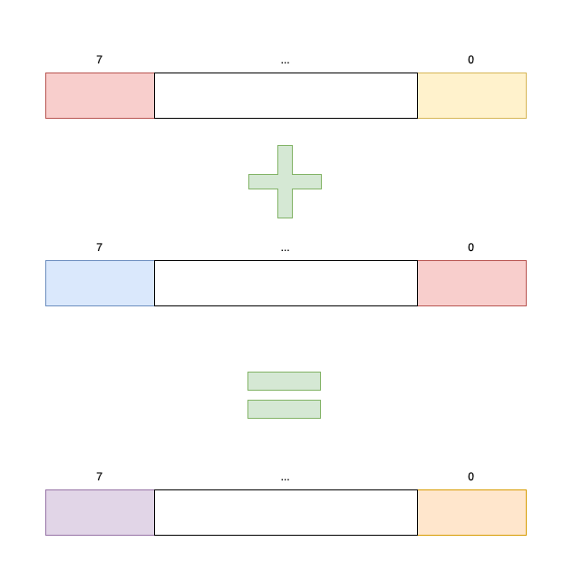

Note that the idea here is to learn how to incorporate a custom accelerator in an SoC by writing an accelerator generator and effectively utilizing the simplicity and extensibility of Chipyard. Our emphasis here is NOT on designing an accelerator from scratch, as that involves learning how to write RTL of significant size and complexity in Chisel, which might not be useful to the majority of the class. 

If you are interested in designing an accelerator or other IP for the course, you should be prepared to write significant RTL. We encourage you to look at sections 1 through 5 of the [Chisel Bootcamp](https://github.com/freechipsproject/chisel-bootcamp) and implement `TODOs` by yourself. 

If not, feel free to utilize answers provided in the lab.

# RoCC Design

- RoCC stands for Rocket Custom Coprocessor. 
- A block using the RoCC interface sits on a Rocket Tile. 
- Such a block uses custom non-standard instructions reserved in the RISC-V ISA encoding space.
- It can communicate using a ready-valid interface with the following:
  - A core on the Rocket Tile, such as BOOM or Rocket Chip (yes, it's an overloaded name :)
  - L1 D$
  - Page Table Walker (available by default on a Rocket Tile)
  - SystemBus, which can be used to communicate with the outer memory system, for instance

<p align="center">
  
</p>

For more on RoCC, we encourage you to refer to:
1. Sections 6.5 and 6.6 of the Chipyard docs, and related examples
2. Bespoke Silicon Group's [RoCC Doc V2](https://docs.google.com/document/d/1CH2ep4YcL_ojsa3BVHEW-uwcKh1FlFTjH_kg5v8bxVw/edit)

Here's an overview of the `customAccRoCC` directory inside `$chipyard/generators/`.
```
 customAccRoCC/
  baremetal_test/       <------ (4) bare-metal functional tests
    functionalTest.c
  project/              <------ project properties/settings
  src/                  <------ source code
    main/               <------ Chisel RTL
      scala/
        configs.scala   <------ (3) Config to include this accelerator
        customAccRoCC.scala <------ RoCC Scaffolding RTL
        vectorAdd.scala     <------ (1) Accelerator RTL 
    test/               <------ Chisel tests
      scala/
        testVectorAdd.scala <----- (2) Basic unit test
  target/               <------ output from build system
```

Let us begin by inspecting `src/main/scala/customAccRoCC.scala`. 
`LazyRoCC` and `LazyRoCCModuleImp` are *abstract* classes that allows us to separate the implementation of a RoCC accelerator from the definition and implementation of the RoCC interface. 
`customAcceleratorModule` provides the implementation of our specific accelerator module. For ease of understanding, we define all functionality in a module called `vectorAdd`, and wire up RoCC I/O signals to `vectorAdd` I/O signals.

Answer the following question:

**1. Find the file `LazyRoCC.scala`. The RoCC interface is defined in `RoCCIO`. What fields does a `RoCCIO` bundle contain?**

## Accelerator RTL

Let us now **implement the accelerator** in `src/main/scala/vectorAdd.scala`, as described above. Your task here is to fill in all blocks/lines marked `/* YOUR CODE HERE */`. 
Questions to consider:
  - What kinds of inputs/outputs does the `vectorAdd` module use? You should inspect the `io` field of the module for this.
  - Does this module use ready-valid interfaces for I/O? How many ready-valid interfaces, and in which directions?


<details>
<summary>In no particular order, here are the required lines of code:</summary>
<br>
<pre><code>sum_vec_wire(i) := in1_vec_wire(i) + in2_vec_wire(i)</code></pre>
<pre><code>cmd_bits_reg.rs2.asTypeOf(in2_vec_wire)</code></pre>
<pre><code>WireInit(VecInit(Seq.fill(8) {0.U(8.W)}))</code></pre>
<pre><code>cmd_bits_reg.inst.rd</code></pre>
</details>


## Testing

The next logical step is testing the `vectorAdd` module to ensure it behaves as expected. There are two main ways to test your design: 
1. using ChiselTest 
2. baremetal functional testing: baremetal here refers to the fact that your tests directly run on the hardware, i.e., no OS underneath.

The former is more useful for fine-grained module-specific testing while the latter is more useful to test the accelerator as a whole, and its interactions with the rest of the SoC. Both kinds of tests will be run in RTL simulation. 

We will unit test with ChiselTest right now, and come back to baremetal testing when integrating our accelerator with the rest of the SoC.
  
<!--
We will be going through each in this section & guiding you through testing your RoCC accelerator. We will be asking you to do the same with the MMIO accelerator. 
-->

### ChiselTest

ChiselTest is the batteries-included testing and formal verification library for Chisel-based RTL designs. It emphasizes tests that are lightweight (minimizes boilerplate code), easy to read and write (understandability), and compose (for better test code reuse). You can find the repo [here](https://github.com/ucb-bar/chiseltest), an overview [here](https://www.chisel-lang.org/chiseltest/) and API documentation [here](https://www.chisel-lang.org/api/chiseltest/latest).

Let us now write a unit test using Chiseltest in `src/test/scala/testVectorAdd.scala`. 

`vectorAddTest` is our test class here, and `"Basic Testcase"` is the name of our only test case. A test case is defined inside a `test()` block, and takes the DUT as a parameter. There can be multiple test cases per test class, and we recommend one test class per Module being tested, and one test case per individual test. 

Here, we will be using Verilator as our simulator backend, and generate waveforms in an fst file.

Most simulation testing infrastructure is based on setting signals, advancing the clock, and checking signals, and asserting their values. ChiselTest does the same with `poke`, `step`, `peek`, and `expect` respectively.

**Complete the unit test named "Basic Testcase"** in `testVectorAdd.scala` by filling in all lines marked `/* YOUR CODE HERE */`.


<details>
<summary>In no particular order, here are the required lines of code:</summary>
<br>
<pre><code>"h_0F_0D_0B_09_07_05_03_01".U</code></pre>
<pre><code>c.clock.step(1)</code></pre>
<pre><code>true.B</code></pre>
</details>


Before we run any tests, we must keep in mind that our RTL is written in Chisel whereas most simulator backends and VLSI tools expect Verilog/SystemVerilog. Thus, we compile our code from Chisel down to an Intermediate Representation (FIRRTL), and finally the relevant Verilog/System Verilog. 

To compile the design and run our tests, we use the Scala Build Tool (sbt). `$chipyard/build.sbt` (in the root Chipyard directory) contains project settings, dependencies, and sub-project settings. Feel free to search for `customAccRoCC` to find the sub-project entry.

In a new terminal window inside **the root Chipyard directory**, run:
```
<your username>@bwrcrdsl-#:$chipyard $ bsub -Is -q ee194 sbt
```

Give it a minute or so to launch the sbt console and load all settings.

In the sbt console, set the current project by running:
```
sbt:chipyardRoot> project customAccRoCC
```

To compile the design, run `compile` in the sbt console, as follows:
```
sbt:customAccRoCC> compile
```
This might take a while as it compiles all dependencies of the project.

To run all tests, run `test` in the sbt console, as follows:
```
sbt:customAccRoCC> test
```

Exit the sbt console with:
```
sbt:customAccRoCC> exit 
```

(You can use `testOnly <test names>` to run specific ones.) Test outputs will be visible in the console. You can find waveforms and test files in `$chipyard/test_run_dir/<test_name>`.

Use `gtkwave` to inspect the waveform at `$chipyard/test_run_dir/Basic_Testcase/vectorAdd.fst`.

**Please ensure your accelerator passes the basic test case before proceeding.**

## Integrating our Accelerator

Now that our accelerator works, it is time to incorporate it into an SoC. We do this by:
1. Defining a config fragment for our accelerator
1. Defining a new config that uses this config fragment

Inside `$chipyard/generators/customAccRoCC`, inspect `src/main/scala/configs.scala`. `WithCustomAccRoCC` is our config fragment here. 

Answer the following questions:

**2. What does `p` do here? (Think about how it could be used, consider the object-oriented, generator-based style of writing, and feel free to look through other generators in Chipyard for examples.)**

**3. Give the 7-bit opcode used for instructions to our accelerator. Searching for the definition of `OpcodeSet` will be useful.**

We want to add our accelerator to a simple SoC that uses Rocket. To do this, we must make our config fragment accessible inside the chipyard generator. Open `$chipyard/build.sbt`. At line 152, add `customAccRoCC` to the list of dependencies of the chipyard project.

Next, navigate to `$chipyard/generators/chipyard/src/main/scala/config/RocketConfigs.scala`. **Define `CustomAccRoCCConfig`** such that it adds our accelerator to `RocketConfig`. The previous step made `customAccRoCC` available as a package here.

Hint: `CustomAccRoCCConfig` should look like the following:
```
class CustomAccRoCCConfig extends Config(
  /* YOUR CODE HERE */
)
```

### Baremetal Functional Testing

Inside `$chipyard/generators/customAccRoCC`, let us inspect `baremetal_test/functionalTest.c`. `rocc.h` contains definitions for different kinds of RoCC instructions and the custom opcodes. We use the same test case as before, but we test integration of the whole system as values are loaded into registers on the Rocket core, sent to the RoCC accelerator, and results from the accelerator are loaded into a register. 

Since our accelerator reads two source registers and writes to one destination register, we use `ROCC_INSTRUCTION_DSS`.

Inline assembly instructions in C are invoked with the `asm volatile` command. Before the first instruction, and after each RoCC instruction, the fence command is invoked. This ensures that all previous memory accesses will complete before executing subsequent instructions, and is required to avoid mishaps as the Rocket core and coprocessor pass data back and forth through the shared data cache. (The processor uses the “busy” bit from your accelerator to know when to clear the fence.) A fence command is not strictly required after each custom instruction, but it must stand between any use of shared data by the two subsystems.

While one can compute results for each test case a priori, and test for equality against the accelerator's results, such a strategy is not reliable nor scalable as tests become complex - such as when using random inputs or writing multiple tests. Thus, there lies significant value in writing a functional model that performs the same task as the accelerator, but in software. Of course, care must be taken in writing a correct functional model that adheres to the spec.

**Inspect `$chipyard/tests/rocc.h`**. 

Answer the following question:

**4. What does the last argument of `ROCC_INSTRUCTION_DSS` stand for? In what situation would you need to use that argument?**

Next, we compile our test by running the following in the `baremetal_test` directory:
```
<your username>@bwrcrdsl-#:$chipyard/generators/customAccRoCC/baremetal_test $ riscv64-unknown-elf-gcc -fno-common -fno-builtin-printf -specs=htif_nano.specs -c functionalTest.c
<your username>@bwrcrdsl-#:$chipyard/generators/customAccRoCC/baremetal_test $ riscv64-unknown-elf-gcc -static -specs=htif_nano.specs functionalTest.o -o functionalTest.riscv
```

Here, we're using a version of gcc with the target architecture set to riscv (without an OS underneath). This comes as part of the riscv toolchain. Since we want a self-contained binary, we compile it statically. 

Now, let's disassemble the executable `functionalTest` by running:
```
<your username>@bwrcrdsl-#:$chipyard/generators/customAccRoCC/baremetal_test $ riscv64-unknown-elf-objdump -d functionalTest.riscv | less
```

Inspect the output. Answer the following question:

**5. What is the address of the `ROCC_INSTRUCTION_DSS`?** 
Looking through `<main>` and looking for `opcode0` should be helpful.

It's time to run our functional test. Let us use VCS this time around. Navigate to `$chipyard/sims/vcs`, run:
```
<your username>@bwrcrdsl-#:$chipyard/sims/vcs $ bsub -Is -q ee194 make -j16 CONFIG=CustomAccRoCCConfig BINARY=../../generators/customAccRoCC/baremetal_test/functionalTest.riscv run-binary-debug
```

It might take a few minutes to build and compile the test harness, and run the simulation.

Inside, `$chipyard/sims/vcs`, for each config,
- `generated-src` contains the test harness
- `output` contains output files (log/output/waveform) for each config.

**Inspect the log and output for our config.** Do the results of the accelerator and model match? (`** PASSED **` in the .out file and output values matching in the .log file should indicate this.)

**Inspect the waveform (.fsdb) for our config** using `verdi -ssf <fsdb file>`. Synopsys has transitioned to a new waveform viewer called Verdi that is much more capable than DVE. Verdi uses an open file format called *fsdb* (Fast Signal Database), and hence VCS has been set up to output simulation waveforms in fsdb.

In the bottom pane of your Verdi window, navigate to `Signal > Get Signals...`. Follow the module hierarchy to the correct module.
```
TestDriver
  .testHarness
    .chiptop
      .system
        .tile_prci_domain
          .tile_reset_domain
            .rocket_tile
              .customAccRoCC
```

# [Optional] Adding Modulo Arithmetic 

We highly encourage those interested in designing accelerators and other custom IP to do the following exercise.

Currently, our accelerator wraps around the range [0, 255], i.e., when the sum of two numbers exceeds 255, you get the result modulo 255. Let's say we desire values saturating at 255. Implement this feature. (Note: As the sum of two unsigned ints >= 0, we don't have to worry about the lower bound.)

You should do the following:
1. Modify RTL
2. Write 1 more unit test
3. Modify the functional model
4. Write an integration test that uses random numbers in the entire range as inputs.


# [Optional] MMIO Design

<em><strong>This is a completely optional design exercise. It's digs more deeply into the Chipyard infrastructure and althought an MMIO accelerator is not difficult inconcept, is rather tricky to integrate. There will be limited support for this part in favor of helping the class understand and internalize the previous parts</strong></em>.

Often, an accelerator or peripheral block is connected to the rest of the SoC with a memory-mapped interface over the system bus. 
This allows the core and external IO to configure and communicate with the block.

```
generator/
  chipyard/
    src/main/scala/
      example/GCD.scala <--------- If you want to see another example
      unittest/         
      config/           <--------- (3) Where we'll test our design
      DigitalTop.scala  <--------- (2) Where we'll connect our deisgn to the rest of the SoC.
      ExampleMMIO.scala <--------- (1) Where we'll design & setup our accelerator. 
```

## Setting up & designing our accelerator
Navigate to `$chipyard/generators/chipyard/src/main/scala/ExampleMMIO.scala` where we'll be designing our MMIO Acclerator. Remember, the goal is to desigin an "accelerator" that takes in two 32-bit* values as vectors of 4 8-bit values. The accelerator takes in 32-bit vectors, adds them, and returns the result.

<!--
##### TODO: 32-bit for now; aiming for 64-bit. Turns out not as easy as just change 32 to 64
-->

Most of the logic of the accelerator will go in `VecAddMMIOChiselModule`. This module will be wrapped by the `VecAddModule` which interfaces with the rest of the SoC and determines where our MMIO registers are placed.

**Add the necessary FSM logic into `VecAddMMIOChiselModule`** Notice how `VecAddMMIOChiselModule` has the trait `HasVecAddIO`. The bundle of input.output signals in `HasVecAddIO` are how the accelerator interaces wit the rest of the SoC.

**Inspect `VecAddModule`** There are 3 main sections: setup, hooking up input/outputs, and a regmap. Setup defines the kinds of wire/signals we're working with. We hook up input/output signals as necessary: we feed x and y into the accelerator along with a rest signal and the clock; we expect the result of the addition; we also use a ready/valid interface to signify when the accelerator is busy or avaiable to process fruther instructions. `VecAddTopIO` is used only to see whether the accelerator is busy or not. Then we have the regmap: 
<!--
##### TODO: add more detail, expecially about section 1 (regarding DecoupledIO, etc.), maybe some more explaining the IO signals.
-->

* `RegField.r(2, status)` is used to create a 2-bit, read-only register that captures the current value of the status signal when read.
* `RegField.w(params.width, x)` exposes a plain register via MMIO, but makes it write-only.
* `RegField.w(params.width, y)` associates the decoupled interface signal y with a write-only memory-mapped register, causing y.valid to be asserted when the register is written.
* `RegField.r(params.width, vec_add)` “connects” the decoupled handshaking interface vec\_add to a read-only memory-mapped register. When this register is read via MMIO, the ready signal is asserted. This is in turn connected to output_ready on the VecAdd module through the glue logic.

RegField exposes polymorphic `r` and `w` methods that allow read- and write-only memory-mapped registers to be interfaced to hardware in multiple ways.

Since the ready/valid signals of `y` are connected to the `input_ready` and `input_valid` signals of the accelerator module, respectively, this register map and glue logic has the effect of triggering the accelerator algorithm when `y` is written. Therefore, the algorithm is set up by first writing `x` and then performing a triggering write to `y`


## Connecting our design to the rest of the SoC
Once you have these classes, you can construct the final peripheral by extending the `TLRegisterRouter` and passing the proper arguments. The first set of arguments determines where the register router will be placed in the global address map and what information will be put in its device tree entry (`VecAddParams`). The second set of arguments is the IO bundle constructor (`VecAddTopIO`), which we create by extending `TLRegBundle` with our bundle trait. The final set of arguments is the module constructor (`VecAddModule`), which we create by extends `TLRegModule` with our module trait. Notice how we can create an analogous AXI4 version of our peripheral.
<!--
##### TODO: more details about what a TLRegisterRouter is?
-->

`VecAddParams` This is where we define where our MMIO accelerator will be placed. `address` determines the base of the module’s MMIO region (0x2000 in this case). Each TLRouter has default size 4096. Everything `address` to `address` + 4096 is accessibl and only the regions defined in the regmap (as preivously defined) will do anything (reads/writes to other regions will be no-ops).

<!--
##### TODO: explain a bit about the other params. 
-->

**Copy paste the following two code blocks into `ExampleMMIO.scala`**
```

class VecAddTL(params: VecAddParams, beatBytes: Int)(implicit p: Parameters)
  extends TLRegisterRouter(
    params.address, "vecadd", Seq("ucbbar,vecadd"),
    beatBytes = beatBytes)(
      new TLRegBundle(params, _) with VecAddTopIO)(
      new TLRegModule(params, _, _) with VecAddModule)

```
```
class VecAddAXI4(params: VecAddParams, beatBytes: Int)(implicit p: Parameters)
  extends AXI4RegisterRouter(
    params.address,
    beatBytes=beatBytes)(
      new AXI4RegBundle(params, _) with VecAddTopIO)(
      new AXI4RegModule(params, _, _) with VecAddModule)

```

Now, we have too hook up everything to the SoC. Rocket Chip accomplishes this using the cake pattern. This basically involves placing code inside traits. In the Rocket Chip cake, there are two kinds of traits: a `LazyModule` trait and a module implementation trait.

The `LazyModule` trait runs setup code that must execute before all the hardware gets elaborated. For a simple memory-mapped peripheral, this just involves connecting the peripheral’s TileLink node to the MMIO crossbar.

**Copy paste the following two code blocks into `ExampleMMIO.scala`**

```
trait CanHavePeripheryVecAdd { this: BaseSubsystem =>
  private val portName = "vecadd"

  // Only build if we are using the TL (nonAXI4) version
  val vecadd = p(VecAddKey) match {
    case Some(params) => {
      if (params.useAXI4) {
        val vecadd = LazyModule(new VecAddAXI4(params, pbus.beatBytes)(p))
        pbus.toSlave(Some(portName)) {
          vecadd.node :=
          AXI4Buffer () :=
          TLToAXI4 () :=
          // toVariableWidthSlave doesn't use holdFirstDeny, which TLToAXI4() needsx
          TLFragmenter(pbus.beatBytes, pbus.blockBytes, holdFirstDeny = true)
        }
        Some(vecadd)
      } else {
        val vecadd = LazyModule(new VecAddTL(params, pbus.beatBytes)(p))
        pbus.toVariableWidthSlave(Some(portName)) { vecadd.node }
        Some(vecadd)
      }
    }
    case None => None
  }
}
```
```
trait CanHavePeripheryVecAddModuleImp extends LazyModuleImp {
  val outer: CanHavePeripheryVecAdd
  val vecadd_busy = outer.vecadd match {
    case Some(vecadd) => {
      val busy = IO(Output(Bool()))
      busy := vecadd.module.io.vec_add_busy
      Some(busy)
    }
    case None => None
  }
}
```

Note that the `VecAddTL` class we created from the register router is itself a `LazyModule`. Register routers have a TileLink node simply named “node”, which we can hook up to the Rocket Chip bus. This will automatically add address map and device tree entries for the peripheral. Also observe how we have to place additional AXI4 buffers and converters for the AXI4 version of this peripheral.


Now we want to mix our traits into the system as a whole. This code is from` generators/chipyard/src/main/scala/DigitalTop.scala`.

**Copy paste ` with chipyard.example.CanHavePeripheryVecAdd` into DigitalTop & `with chipyard.example.CanHavePeripheryVecAddModuleImp` into DigitalTopModule**

Just as we need separate traits for `LazyModule` and module implementation, we need two classes to build the system. The `DigitalTop` class contains the set of traits which parameterize and define the `DigitalTop`. Typically these traits will optionally add IOs or peripherals to the DigitalTop. The `DigitalTop` class includes the pre-elaboration code and also a `lazy val` to produce the module implementation (hence `LazyModule`). The `DigitalTopModule` class is the actual RTL that gets synthesized.

And finally, we create a configuration class in `$chipyard/generators/chipyard/src/main/scala/config/RocketConfigs.scala` that uses the WithVecAdd config fragment defined earlier.

**Copy paste the following**
```
class VecAddTLRocketConfig extends Config(
  new chipyard.example.WithVecAdd(useAXI4=false, useBlackBox=false) ++          // Use VecAdd Chisel, connect Tilelink
  new freechips.rocketchip.subsystem.WithNBigCores(1) ++
  new chipyard.config.AbstractConfig)
```

## Testing Your MMIO

Now we're ready to test our accelerator! We write out test program in `$chipyard/tests/examplemmio.c` Look through the file and make sure you understand the flow of the file. 

**Add in a C reference solution for our accelerator**

To generate the binary file of the test, run two following two commands in the terminal

`riscv64-unknown-elf-gcc -std=gnu99 -O2 -fno-common -fno-builtin-printf -Wall -specs=htif_nano.specs -c examplemmio.c -o examplemmio.o`

`riscv64-unknown-elf-gcc -static -specs=htif_nano.specs examplemmio.o -o examplemmio.riscv`

Then, navigate to `$chipyard/sims/verilator` and run `make CONFIG=VecAddTLRocketConfig BINARY=../../tests/examplemmio.riscv run-binary-debug` to run the test. If successful, you should see the terminal print whether you passed the test or not. This may take a while.

<!--
##### TODO: maybe something about debugging chisel? making sense of logs?
-->

**Please submit:**
1. The entirety of the code for `VecAddMMIOChiselModule`.
2. Your entire C refenence solution.
3. A screenshot of your test passing.c

# END OF CHIPYARD LAB (due EoD 1/27)

 <!--
## VLSI Flow

### Design Elaboration

The Hammer flow we have used throughout the semester is integrated into Chipyard.
A project setup similar to the ones we have previously used is in `chipyard/vlsi`.
To set up VLSI back-end design, run: 

```
cd chipyard
scripts/init-vlsi.sh intech22
cd chipyard/vlsi
source hammer/sourceme.sh
```

**Note: For all compute intensive commands in the VLSI flow (all make commands from this point forwards, as well as launching Innovus via `open_chip`), run them on the LSF.** In other words, prepend the command with

```
bsub -Is
```

To setup the Hammer back-end flow, run:

```
make CONFIG=RocketConfig TOP=RocketTile tech_name=intech22 INPUT_CONFS="rockettile.yml" buildfile
```

Lets go through the various flags in this command:

- `CONFIG` sets the system config, the same way we set the config for RTL simulation
- `TOP` specifies the name of the module which will be the "top" module in our flow. The actual "top" of a design is `ChipTop`, but for this example, we will choose the `RocketTile` sub-module to run the flow
- `tech_name` specifies the target technology. You many want to edit the default setting for this in `vlsi/Makefile`, instead of specifying it each time you run a VLSI command
- `INPUT_CONFS` specifies a list of input YAML files which specify settings for HAMMER and the VLSI tools. You may want to edit the default setting for this in `vlsi/Makefile`, instead of specifying it each time you run a VLSI command
  - `rockettile.yml` specifies design-specific settings, in this case settings for running the VLSI flow when `RocketTile` is the top module
- The`buildfile` target describes a Makefile fragment that will be used in the actual VLSI flow (syn/par/drc/lvs), which we will run next. After this command runs, the generated verilog for the design should appear in the `vlsi/generated-src` directory.

One important difference between the `make` command for the VLSI flow, compared with the `make` command for the RTL simulation flow, is that in the VLSI flow the memories in the design will be mapped to hard SRAM macros available in the Hammer technology library. In the `generated-src/chipyard.TestHarness.RocketConfig` directory, inspect the file with the `.top.mems.conf` and `.top.mems.v` extensions. These files describe the parameters of the memories in the design, as well as the actual verilog instantiations of each memory.

**Q: What is the breakdown of SRAM blocks for each of the memories in the design? (this can be found by looking at the files described above.)**

### Synthesis

Now that the design is elaborated, we can leverage the Hammer infrastructure we have used this semester to physically build our system in much the same way as before.
Our Hammer config is in `rockettile.yml`. Here you can see we have again constrained our top-level clock to be 50 MHz. It is pretty straightforward to close timing for the Rocket core in the 100's of MHz with limited physical design input using Hammer out-of-the-box, but we are running it at this lower frequency to ease our design constraints.

To run synthesis, run:

```
make CONFIG=RocketConfig TOP=RocketTile tech_name=intech22 INPUT_CONFS="rockettile.yml" syn
```

This step should take up to about 1 hour.  If you are ssh'd directly into the machine (not using X2go, etc.), you should use a utility like `tmux` to make sure that you don't lose your run if you lose your connection or log off.
When it completes, you can look at the results just like before in `syn-rundir/reports/` to confirm your design passed timing.

**Q: What is the critical path in the design after synthesis? This can be found by inspecting the timing reports in the directory described above.**


### Place-and-route

The next step is to run place-and-route on the synthesized netlist. 

```
make CONFIG=RocketConfig TOP=RocketTile tech_name=intech22 INPUT_CONFS="rockettile.yml" par
```

This step will also be pretty slow.
You can open up the final design in Innovus using `par-rundir/generated-scripts/open_chip`.

#### Floorplanning

Floorplanning is a key step to all designs and will have a huge effect on your design's QoR. Hammer's placement constraints API provides several options for controlling the floorplan. You can look in `rockettile.yml` to see how these constraints are being used.

- "placement" constraints constrain the position of an instance. For example, the constraints on the positions of the FPU and Core modules within the RocketTile. These constraints are more like guidelines to the tool, rather than restrictions
- "hardmacro" constraints constrain the position of hard macros. You can see we constrain the position of all the SRAM macros in the design
- "hierarchical" constraints are used in the Hammer hierarchical flow, where sub-modules of the design are individually place-and-routed
- "obstruciton" constraints can block placement of standard cells, routing, or power straps.

In this case, we should adjust the placement of the SRAM macros for our Rocket core's L1 caches.
In these Hammer constraints, you can see that the lower-left hand corner placement is specified (in microns) as well as the orientation (see `hammer/src/hammer-vlsi/defaults.yml` for documentation on all placement options).

Take a look at the layout, and notice where an obvious improvement in the floorplan can be made. Modify the specification in `rockettile.yml`.

After editing an input yml/json file, the Hammer Make include file will detect this and re-run the flow. This means that any change to any yml/json will rerun the entire syn-pnr flow after a change to `rockettile.yml`.

If you want to rerun only part of the flow (for example, only par), you have to use special `redo-STEP` flags and `HAMMER_EXTRA_ARGS`. This is because Hammer does not know which config options only affect place-and-route, so to be safe, the Hammer Makefile will rerun all prerequisite steps.

In our case, modifying the floorplan does not affect synthesis at all, so we can make the informed decision to avoid rerunning synthesis. Note that should always be done with great caution, as otherwise, changes in your design or config may not propagate to your time-consuming job.

To rerun only place-and-route after editing only floorplan constraints, run

```
make CONFIG=RocketConfig TOP=RocketTile tech_name=intech22 INPUT_CONFS="rockettile.yml" HAMMER_EXTRA_ARGS="-p rockettile.yml" redo-par
```

**Q: Include a picture of your design in Innovus with the top two metal layers turned off.**

**Q: Explain your modification to the provided floorplan, and show it in the layout.**

**Q: How much setup timing slack is there in the design?**

**Q: Include a picture of the clock tree debugger for your design from Innovus and comment on the balancing.**

#### Hierarchical Flows

In the actual class tapeout, and in most large tapeouts, the flow is hierarchical. Meaning that subcomponents will be place-and-routed as blocks, before the parent module places them as macros. If we were to do a two-level hierarchical flow, where the RocketTile is the only child module, the next step would be to synthesize and place-and-route the parent ChipTop module.

### DRC

Running DRC (Design rule checks) verifies that the layout emitted after place-and-route adheres to all the foundry rules, and is manufacturable.

Note: The example design is not intended to be DRC-clean.

```
make CONFIG=RocketConfig TOP=RocketTile tech_name=intech22 INPUT_CONFS="rockettile.yml" drc-block
```


### LVS

Running LVS (layout vs. schematic) verifies that the netlist in the final layout matches the expected netlist.

Note: The example design is not intended to be LVS-clean.

```
make CONFIG=RocketConfig TOP=RocketTile tech_name=intech22 INPUT_CONFS="rockettile.yml" lvs-block
```

-->

<!-- ## Rest of the VLSI Flow -->

<!-- Running DRC and LVS is not required for this lab, but you can run them though Hammer just like before. -->
<!-- The placement of macros like SRAMs can cause considerable numbers of DRC and LVS errors if placed incorrectly and can cause considerable congestion if placed non-optimally. -->
<!-- The floorplan visualization tools in Hammer can help you root out these problems early in your design process. -->

<!---

## Conclusion

Chipyard is designed to allow you to rapidly build and integrate your design with general purpose control and compute as well as a whole host of other generators.
You can then take your design, run some RTL simulations, and then push it through the VLSI flow with the technology of your choice using Hammer.
The tools integrated with Chipyard, from how you actually build your design (eg. Chisel and generators), to how you verify and benchmark its performance, to how you physically implement it, are meant to enable higher design QoR within an agile hardware design process through increased designer productivity and faster design iteration.
We just scratched the surface in this lab, but there are always more interesting features being integrated into Chipyard.
We recommend that you continue to explore what you can build with Chipyard given this introduction!

## Acknowledgements

Thank you to the whole Chipyard dev team for figures and documentation on Chipyard, and to Daniel Grubb for authorship of the original tutorial on which this lab is based.

-->
